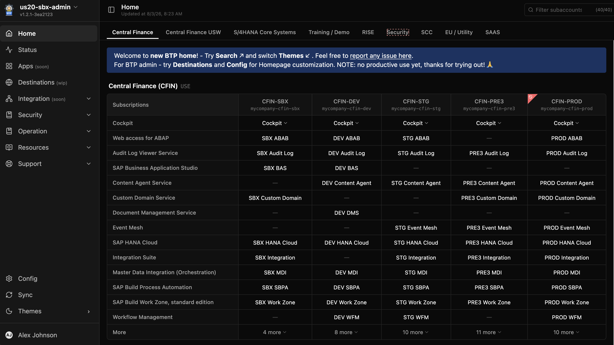

# BTP Admin

A lightweight, file-backed admin dashboard and status monitor for SAP BTP. Provides a configurable **BTP Homepage** for navigating subaccounts and services across global accounts, plus a **status page** with a health checker for Azure Traffic Manager integration and a service availability history view.

## Home Page for BTP Services

A configurable navigation hub. Organise your BTP global accounts into tabs and subaccount groups; each subaccount column renders service links resolved from named URL templates — Cockpit, Launchpad, BAS, Integration Suite, HANA Cloud, and more. A **Cockpit** row provides deep dropdown navigation with per-space sub-menus. Sidebar `menus` groups expose curated links (documentation, portals, tools) with optional `public` filtering for unauthenticated users.



## Status Page for Users and Azure Traffic Manager

Each BTP Status instance is deployed in a different region. A `browser-ias-login` endpoint performs a full headless login to SAP Workzone every few minutes, with automatic retries on transient failures. The result is exposed via `GET /health/:service` — returning `200 OK`, `200 Partial OK`, or `500 Service down` depending on whether all, some, or none of the recent checks passed.

Azure Traffic Manager polls these health endpoints from multiple PoPs. When all probes from a region consistently return `500`, Traffic Manager stops routing end-user traffic there and fails over to the healthy region. Once the degraded instance recovers and probes return `200`, Traffic Manager automatically restores it to rotation.


## Destination Maintenance

A cross-subaccount destination management view at `/destinations`. All subaccounts with `manageDestinations = true` appear as columns grouped by the same tab/section structure as the Home page. Destinations are categorised into rows: **Generic** (`API_[S4|MDG]_[HTTP|RFC]_*`), **Specific S/4** (other `API_*`), **Workzone** (`cep-*-runtime`), and **OTHERS**.

Clicking any cell or subaccount header opens the **Subaccount Destinations modal** with:
- A searchable destination list with Ctrl/Shift+click multi-select for bulk export
- **Properties tab** — editable key/value table; sensitive fields masked with lock/eye-reveal; Create, Import (single or array JSON), Export, Refresh, Reset, and Save
- **History tab** — field-level diff log for every save, import, and create
- **Test tab** — HTTP request builder with request headers, body, and a split response panel

**Refresh** fetches all destination configurations from the SAP BTP Destination service API. Credentials are discovered via CF v3 by service plan GUID and cached in `~/.ba/destination-keys.json`; OAuth2 tokens are cached in `~/.ba/destination-tokens.json`. Changed destinations produce a field-level diff written to `{name}.changelog.md`; removed destinations are renamed to `{name}.deleted.json`.

**Proactive refresh** — when the modal opens, the server checks whether the cached data for that subaccount is older than `AUTO_SUBACCOUNT_REFRESH_MINS` (default 10 min; set to `0` to disable) and refreshes automatically if stale. When the Destination Overview page opens, `AUTO_GLOBAL_REFRESH_HRS` (default 6 h; set to `0` to disable) governs an automatic background refresh of all subaccounts. Both vars apply to destinations and role collections alike; both can be set as environment variables or in `config.json → variables`; both accept fractional values (e.g. `0.5`).

**Full-text search** — pressing Enter on the search input triggers a server-side scan of all destination JSON files; matches filter the tab/column/row view and highlight matched text.

**Compare** — select destinations across any subaccounts with the `Compare (N) ▾` split-button; a full-screen side-by-side modal highlights rows where values differ and allows per-column Save.

## Role Collections Management

A cross-subaccount role collection management view at `/rcs`. All subaccounts with `manageRoles = true` appear in the overview table. Clicking **Browse** opens the **Subaccount Role Collections modal**.

Clicking any subaccount opens the **Subaccount Role Collections modal** with:
- A searchable role collection list in the left panel
- **Details tab** — role references table (template name, app ID, description)
- **Users tab** — assigned users list with add/remove; add accepts an email/username and origin (e.g. `sap.ids`)
- **Changelog tab** — field-level diff log for every save and refresh

**Refresh** fetches all role collections from the XSUAA REST API (`/sap/rest/authorization/v2/rolecollections`). XSUAA credentials are discovered via CF v3 by locating an `xsuaa/apiaccess` service instance in the org, reading the first service key, and caching keys in `~/.ba/xsuaa-keys.json`; OAuth2 tokens are cached in `~/.ba/xsuaa-tokens.json`. Changed role collections produce a diff written to `{safeName}.changelog.md`; removed role collections are renamed to `{safeName}.deleted.json`.

A global `{LOCAL_STORE_DIR}/rcs/changelog.md` is updated after each refresh with a summary of created/updated/deleted role collections. Subaccount data lives in `{LOCAL_STORE_DIR}/rcs/{region}/{subdomain}/`.

**Remote sync** — the `rcs/` folder is included in the sync manifest and propagated to consumer instances just like `dest/` data.

## Users Management

A cross-subaccount user management view at `/users`. All subaccounts with `manageRoles = true` appear in the overview table, grouped by the same tab/section structure as the Home page. Each subaccount column shows the 16 most-recently-logged-on users (email + last logon time). Clicking any email or column header opens the **Subaccount Users modal**.

The **Subaccount Users modal** provides:
- A header cockpit dropdown button (when cockpit settings are configured) for quick Cockpit navigation, with a plain `{alias} ({subdomain})` fallback
- A filter input and sorted user list in the left panel (sorted by last logon time descending by default)
- **User Detail tab** — all XSUAA user attributes: ID, username, name, emails, active/verified, origin, zone, group count, logon times, meta timestamps
- **Global Access tab** — collapsible tree of all role collection group assignments for this user across every other subaccount in the local store; each parent row is the subaccount, child rows show `value / display / type` for each group
- **Change History tab** — per-user field-level diff log for every refresh
- **Export** — downloads the full user JSON as `{region}_{subdomain}_{origin}_{email}.json`
- **Refresh** — per-subaccount refresh with a progress banner

**Refresh** fetches all XSUAA users from the XSUAA REST API (`GET /sap/rest/authorization/v2/users?count=500&startIndex=N`) using the same XSUAA apiaccess credential chain as Role Collections (keys cached in `~/.ba/xsuaa-keys.json`, tokens in `~/.ba/xsuaa-tokens.json`). Users are paginated via SCIM `startIndex`. After each API fetch, records sharing the same `origin + email` key but with different internal IDs are deduplicated (latest `meta.lastModified` wins). Changed user records produce a field-level diff (excluding `passwordLastModified`, `previousLogonTime`, `lastLogonTime`) written to `{email}.changelog.md`; removed users are renamed to `{email}.deleted.json`.

A global `{LOCAL_STORE_DIR}/users/changelog.md` is updated after each global refresh. Subaccount data lives in `{LOCAL_STORE_DIR}/users/{region}/{subdomain}/{origin}/`, where `email` = `emails[0].value` falling back to the XSUAA `id` UUID when the email field is absent or empty.

**Full-text search** — pressing Enter on the Users Overview search input triggers a server-side scan of all `{LOCAL_STORE_DIR}/users/` JSON files matching `userName`, `emails[].value`, `name.givenName`, `name.familyName`, `origin`, and `groups[].display`; matches filter the overview and highlight matched email text.

**Remote sync** — the `users/` folder is included in the sync manifest and propagated to consumer instances.

## Screenshots

**Overview** — landscape diagram with live service status and timeline dots


**Service detail** — uptime stats, response time chart, and full check history


**Drill-down** — full request/response detail and screenshot from a past check


## Features

### BTP Homepage

- **Configurable navigation hub** at `/home` — organise BTP subaccounts into tabs and group sections; tab structure is driven by `tabs.json`, subaccount columns by `subaccounts.json`, cockpit menu by `cockpit-menu.json`, and main subscription rows + sidebar menus by `settings.json`; the active tab is reflected in the URL as `/home/{tab}` for bookmarking and sharing; a **filter input** in the title bar (top-right, after Last updated) searches all subaccount fields and nested objects in real time with an inline `(X/Y)` counter showing matched vs. total; column headers are now clickable and open the **Subaccount Detail modal** (with Open Cockpit dropdown when cockpit settings are configured)
- **Cockpit dropdown** — the cockpit navigation tree is defined in `server/config/cockpit-menu.json` with `{placeholder}` substitution (`{cockpitRegion}`, `{globalAccountGUID}`, `{subaccountId}`, `{subdomain}`, `{orgId}`) and `repeatOn: "spaces"` expansion for per-space sub-menus; no manual URL construction required
- **Main subscriptions & More** — `settings.homepage.mainSubscriptions` controls which subscription rows appear directly on the home page; subscriptions present in the subaccount but not in the list appear in a **More** dropdown per column
- **Sidebar menus from `settings.json`** — configurable link groups (`settings.menus`) drive the sidebar nav items below the main pages; each menu entry has a text label, a Lucide icon name, and submenus with `public: true/false` to control visibility before login; `GET /api/settings` is public so menus load before authentication
- **Config page** (`/config`) — four tabs: **Subaccounts** (manage `subaccounts.json`, run Refresh from SAP BTP + CF API, drag-reorder, SSE progress bar with dismiss X button; subaccount detail modal shows Open Cockpit dropdown and space ID links to BTP cockpit), **Tabs / Groups** (manage `tabs.json` with section editors for subaccountGroup / banner / table), **Settings** (manage `settings.json` — cockpit IDP/host, main subscriptions, and sidebar menus with drag-reorder and a save-status banner), and **Change Log** (audit trail for all config writes); **Import** button always replaces all three config files (`subaccounts.json`, `tabs.json`, `settings.json`) — keys absent from the import are cleared to empty/defaults; a confirmation dialog summarises what will be replaced and what will be cleared before proceeding; every import is diffed against the previous state and appended to `changelog.md`; a **Preview** toggle in the title bar opens a live home page preview panel alongside the config editor — reflects all unsaved draft changes in real time; the divider between config and preview is draggable to adjust panel widths

### BTP Status Page

1. **Azure Traffic Manager probe endpoint** — `GET /health/{service}` returns `200 OK`, `200 Partial OK`, or `500 Service down` from saved response files without a live network probe; designed for Traffic Manager polling every 3–5 s from multiple PoPs; region-extracted from the request hostname so each deployed instance reports only its local endpoints

2. **Browser-based IAS login simulation** (`mode: browser-ias-login`) — headless Chromium fills the SAP IAS login form and validates the full authentication flow end-to-end; screenshot, console log, and page source captured on every check and visible in the history drill-down

3. **Evaluation mode override** (`Always OK` / `Always Error`) — per-service toggle to force a service healthy or failing regardless of actual check results; changes take effect immediately on `/health`, scheduled checks, and Run Test

4. **Status timeline, history, and drill-down** — color-coded timeline per endpoint on the Overview page; per-service uptime %, response time chart, and full history table with endpoint/location/status/tag filters; clicking any dot opens a response detail modal with request/response, conditions, and screenshot

5. **Starred response files** — click ⭐ on any history row to pin a record; starred files are retained by housekeeping indefinitely, survive remote sync, and are filterable via **Starred** in the tag filter and the **All Time Starred** date range option

### BTP Destinations Management

1. **Destination Overview** (`/destinations`) — cross-subaccount matrix of SAP BTP Destination service configurations; tabs and group sections mirror the Home page layout; only subaccounts with `manageDestinations = true` appear as columns; destinations are grouped into rows: **Generic** (`API_[S4|MDG]_[HTTP|RFC]_*`), **Specific S/4** (other `API_*`), **Workzone** (`cep-*-runtime`), and **OTHERS**

2. **Refresh** — **Refresh** button fetches all destination configurations from the Destination API for all managed subaccounts; changed destinations produce a field-level diff written to `{name}.changelog.md`; removed destinations renamed to `{name}.deleted.json`; SSE progress bar shows per-subaccount progress with a dismiss button; after each global refresh a `{LOCAL_STORE_DIR}/dest/changelog.md` is written with an `[Auto|Manual]` header, a summary line, and (for delta refreshes) a per-destination list of created/updated/deleted entries with links; the file rotates to `changelog.yyyyMMdd-HHmmss.md` when it exceeds 2 MB

3. **Full-text search** — pressing Enter on the Destination Overview search input triggers a server-side scan of all `{LOCAL_STORE_DIR}/dest/` JSON files; results filter the tab/column/row view and highlight matched text; an active-filter chip shows the query and total match count

4. **Subaccount Destinations modal** — opened from any destination cell, subaccount header, OTHERS button, or search result; when the subaccount has `manageDest` spaces the left panel splits into a collapsible space→instance tree (top) and a flat destination list (bottom), both vertically resizable; right panel has three tabs (deep-linkable: `/destinations/:region/:subdomain/:name/history` and `/test`; instance destinations use `/destinations/:region/:subdomain/:spaceName/:instanceName/:instanceGuid/:name`):
   - **Properties** — editable key/value table; sensitive fields (password, secret, credential) masked with a lock icon and eye-reveal toggle; toolbar: **Create** (new destination from scratch), **Import** (single or array JSON with pre-flight confirmation dialog), **Export** (single file or `multi_destinations.json` for N selected), **Refresh** (force-refreshes this subaccount), **Select for Compare**, **Delete** (selected destinations with confirmation), **Reset**, **Save**; save result shown as an inline banner (green auto-dismisses after 3 s, error stays with ✕)
   - **History** — field-level diff log prepended on every save, import, and create; each entry shows changed fields with before → after values and the author's identity
   - **Test** — live HTTP request builder: method selector, URL/path input (appended to the destination base URL), editable request headers, and body textarea; sends a real HTTP request through the destination (internet or OnPremise via Cloud Connector); response panel shows status badge (green ≤299 / amber 3xx–4xx / red 5xx), duration, response headers, and body; **Format JSON** checkbox in the response pane header formats the body when `content-type` is `application/json`; supports `NoAuthentication` and `BasicAuthentication` for internet destinations and all auth types (including `PrincipalPropagation` via `jwt-bearer` grant) for OnPremise destinations; if the destination has a `sap-client` property, the header is automatically forwarded; all test state (URL, headers, body, response) persists across tab switches and resets only when the selected destination changes
   - **Import dialog** — pre-flight confirmation dialog shows target scopes (left panel: subaccount and/or selected instances) and uploaded destinations (right panel); sequential PUTs with a live `X of Y created/updated: <name>` progress strip; completion shows a green success or amber/red error banner with a list of failed destinations; all imports share one grouped `[Manual] … destinations imported by …` entry in the destination changelog and in the global changelog
   - **Delete dialog** — confirmation dialog lists all destinations to be deleted with full path (`region > alias (subdomain) [> space > instance] > name`); amber warning that the operation is not reversible and to consider export first; sequential DELETEs with live `X of Y deleted: <name>` progress strip; each deleted destination gets a `[Manual] destination deleted by …` changelog entry; destination files are renamed to `{name}.deleted.json`; a grouped entry is added to the global changelog

5. **Change History tab** (`/destinations/change-history`) — shows the global `dest/changelog.md` with color-coded entries (green = created, amber = updated, red = deleted); a dropdown selects archived changelog files; live-updates via `dest` SSE events

6. **Compare Destinations** — `Compare (N) ▾` split-button accumulates destinations from any subaccount across any tab; the ▾ dropdown lists selected destinations with per-item and **Clear all** removal; clicking **Compare (N)** opens a full-screen modal with all property keys as rows and one column per destination; rows where values differ are highlighted in amber; cells are editable (sensitive fields masked with eye-reveal); per-column **Save** writes back via `PUT /api/destinations/:region/:subdomain/:name` and appends a diff to the destination's changelog; save result banners appear under the modal title

### BTP Role Collections Management

1. **Role Collections Overview** (`/rcs`) — table listing all subaccounts with `manageRoles = true`; shows region, subdomain, and role collection count; **Browse** opens the per-subaccount modal; SSE progress bar tracks global refresh progress

2. **Refresh** — fetches all role collections from the XSUAA REST API for all managed subaccounts; credentials discovered from an `xsuaa/apiaccess` service instance in the org via CF v3, cached in `~/.ba/xsuaa-keys.json`; tokens cached in `~/.ba/xsuaa-tokens.json`; changed role collections produce a diff appended to `{safeName}.changelog.md`; removed role collections are renamed to `{safeName}.deleted.json`; a `{LOCAL_STORE_DIR}/rcs/changelog.md` is written after each run

3. **Subaccount Role Collections modal** — opened from **Browse**; left panel: searchable list of all role collections; right panel has three tabs:
   - **Details** — role references table (template name, app ID, description)
   - **Users** — assigned users list with add-user form (email/ID + origin) and per-row remove button; changes call the live XSUAA API
   - **Changelog** — field-level diff log for every refresh and save

4. **Change History tab** (`/rcs/change-history`) — shows the global `rcs/changelog.md` with color-coded entries; archive file dropdown; live-updates via `rcs` SSE events

5. **Remote sync** — `rcs/` folder included in sync manifest; role collection data synced to consumer instances alongside destinations and config

### BTP Users Management

1. **Users Overview** (`/users`) — cross-subaccount view of XSUAA users; tabs and group sections mirror the Role Collections layout; only subaccounts with `manageRoles = true` appear; each SA column shows the 16 most-recently-logged-on users with email and last logon time; global **Refresh** with SSE progress bar; **Change History** tab showing `users/changelog.md`; live updates via `users` SSE topic; auto global refresh on page open when stale (threshold: `AUTO_GLOBAL_REFRESH_HRS`)

2. **Refresh** — fetches all XSUAA users via the SCIM API (`count=500`, paginated via `startIndex`); reuses the same `xsuaa/apiaccess` credential chain as Role Collections; after each API fetch, records sharing the same `origin + email` key but with different internal IDs are deduplicated before storage (latest `meta.lastModified` wins); changed user records produce a field-level diff (ignoring `passwordLastModified`, `previousLogonTime`, `lastLogonTime`) appended to `{email}.changelog.md`; removed users renamed to `{email}.deleted.json`; global `users/changelog.md` updated after each run (rotates at 2 MB)

3. **Subaccount Users modal** — header: cockpit dropdown button (when cockpit settings are configured) for Cockpit navigation; left panel: filter input + scrollable user list (sorted by last logon time descending by default); right panel:
   - **User Detail** — all XSUAA user attributes (ID, username, name, emails, active, verified, origin, zone ID, group count, logon timestamps, meta dates)
   - **Global Access** — collapsible tree listing every subaccount where this user appears, with their group assignments (`value / display / type`); all rows expanded by default
   - **Change History** — per-user field-level diff log for every refresh; `+` lines in green, `-` lines in red
   - **Export** — downloads the full stored user JSON as `{region}_{subdomain}_{origin}_{email}.json`
   - **Refresh** — per-subaccount refresh with inline progress banner (auto-dismisses after 3 s on success)

4. **Full-text search** (`/api/users/search?q=`) — server-side scan of all user JSON files; matches `userName`, `emails[].value`, `name.givenName`, `name.familyName`, `origin`, `groups[].display`; results filter and highlight matched emails in the overview table

5. **Remote sync** — `users/` folder included in sync manifest; user data synced alongside destinations and role collections; `globalUsersRefreshTs` restored at startup by parsing the topmost header in `users/changelog.md`

## Quick Start

### Prerequisites

- Node.js 20+
- npm 9+

### Development

```bash
# 1. Install dependencies (also installs Chromium for browser checks via postinstall)
npm install

# 2. Copy sample config and fill in real values
cp sample/config.json server/config.json
# Edit server/config.json with your real service endpoints and credentials

# 3. Build client once, then start Express (serves UI + API on :3000)
npm run dev
```

Open http://localhost:3000/

> **`PLAYWRIGHT_BROWSERS_PATH`**: `npm install` installs Chromium into `server/pw-browsers/` via the `postinstall` hook (using `PLAYWRIGHT_BROWSERS_PATH=./pw-browsers`). The `npm run dev` and `npm start` scripts set the same variable automatically so the server finds Chromium at that path. If you start the server directly — outside of an npm script — set `PLAYWRIGHT_BROWSERS_PATH=<repo-root>/server/pw-browsers` in your shell first, otherwise browser-based health checks will fail to launch Chromium.

When iterating on the frontend, rebuild the client in a second terminal while the server keeps running:

```bash
# Terminal 1 — Express with auto-restart on server file changes
npm run dev:server

# Terminal 2 — Vite rebuild on every client file change
npm run watch:client
```

### Production Build (local)

```bash
npm run build:client && npm run build:server   # build React → server/public/, compile TypeScript
npm start                                       # runs Express on PORT (default 3000)
```

## Configuration

### settings.json — Cockpit, Subscriptions, and Sidebar Menus

`{LOCAL_STORE_DIR}/conf/settings.json` (falls back to `server/config/default-settings.json`). Managed via **Config → Settings**.

```json
{
  "homepage": {
    "cockpit": { "idp": "sap.default", "host": "amer.cockpit.btp.cloud.sap" },
    "mainSubscriptions": [
      { "name": "SAP Business Application Studio", "alias": "BAS" },
      { "name": "SAP Integration Suite", "alias": "IS" }
    ]
  },
  "menus": [
    {
      "text": "Resources",
      "icon": "book-open-text",
      "submenus": [
        { "text": "SAP BTP What's New", "url": "https://help.sap.com/whats-new/...", "public": true }
      ]
    }
  ]
}
```

| Field | Description |
|-------|-------------|
| `homepage.cockpit.idp` | SAP IAS identity provider alias used in cockpit deep-links |
| `homepage.cockpit.host` | Cockpit hostname (e.g. `amer.cockpit.btp.cloud.sap`) |
| `homepage.mainSubscriptions` | Ordered list of subscriptions shown as rows on the Home page; others appear in a **More** dropdown; `alias` is shown as the link label |
| `menus` | Sidebar link groups; `icon` is a Lucide icon name (kebab-case); `submenus[].public: true` shows the link to unauthenticated users |

### tabs.json — Tab Sections Configuration

`{LOCAL_STORE_DIR}/config/tabs.json` maps subaccounts to homepage tabs and drives the Destination Overview tab/group layout.

**Format:**

```json
[
  {
    "tab": "Tab Name",
    "sections": [
      { "type": "subaccountGroup", "title": "Optional group heading", "groupId": "my-group" },
      { "type": "banner", "message": "**Note:** some *markdown* text", "backgroundColor": "blue" },
      { "type": "table", "title": "Optional table heading", "tableContent": [["Col A", "Col B"], ["val 1", "val 2"]] }
    ]
  }
]
```

**Section types:**

| `type`             | Fields                                                       | Notes                                              |
|--------------------|--------------------------------------------------------------|----------------------------------------------------|
| `subaccountGroup`  | `groupId` (required), `title` (optional)                    | Joins with `subaccounts.json` `groupIds` CSV field |
| `banner`           | `message` (required), `backgroundColor` (required)          | `message` supports markdown (bold, italic, links)  |
| `table`            | `tableContent` (required 2D array), `title` (optional)      | Cells support markdown (e.g. `[text](url)`)        |

**`backgroundColor` options for banners:** `transparent` · `blue` · `green` · `yellow` · `red` · `purple`

**Migration:** existing files using the old `groups: [{groupId, groupTitle}]` format are automatically converted to `sections[]` of type `subaccountGroup` on next read — no manual migration needed.

### Status Page Configuration

The server resolves configuration in this priority order:

1. **`CONFIG_JSON` env var** — JSON string with the full config (useful for BTP env properties, no file needed)
2. **`CONFIG_FILE` env var / default** — path to a JSON file (default: `./config.json` relative to the `server/` working directory, i.e. `server/config.json` from the repo root)

Create `server/config.json` (copy `sample/config.json` and fill in real values):

```json
{
  "variables": {
    "MONITOR_USERNAME": "monitor@example.com",
    "MONITOR_PASSWORD": "your-monitor-password",
    "SYNC_KEY": "your-secret-sync-key"
  },
  "landscapes": [
    {
      "name": "production",
      "diagram": "flowchart LR\n    User --> my-service"
    }
  ],
  "services": [
    {
      "group": "WorkZone",
      "name": "my-service",
      "enabled": true,
      "landscapes": ["production"],
      "interval": 900,
      "endpoints": [
        {
          "name": "Health Check",
          "url": "https://my-service.example.com/health",
          "method": "GET",
          "conditions": [
            "[STATUS] == 200",
            "[RESPONSE_TIME] < 3000"
          ]
        },
        {
          "mode": "browser-ias-login",
          "name": "Login Check",
          "url": "https://my-service.example.com/login",
          "username": "{{MONITOR_USERNAME}}",
          "password": "{{MONITOR_PASSWORD}}",
          "waitForSelector": "#app-title",
          "timeout": 30000
        }
      ]
    }
  ]
}
```

#### Config Fields

**Top-level**

| Field | Type | Description |
|-------|------|-------------|
| `variables` | object | Key→value map; `{{key}}` placeholders in endpoint fields are substituted at startup |
| `landscapes` | array | List of landscape definitions for the Overview diagram tabs |
| `landscapes[].name` | string | Landscape identifier (shown as tab label) |
| `landscapes[].diagram` | string | Mermaid diagram source. Nodes whose ID matches a service `name` are coloured by status and link to the service detail page. Nodes in `service.endpoint` format (e.g. `wz-us10.Workzone-Login`) show the per-endpoint status and link directly to that endpoint's filtered view (`/service/wz-us10?endpoint=Workzone-Login`). |
| `sites` | array | List of deployed instances for the site-switcher dropdown (optional; dropdown hidden when fewer than 2 entries) |
| `sites[].name` | string | Display name for the site (e.g. `"Ashburn"`, `"Frankfurt"`) |
| `sites[].url` | string | Base URL of that deployed instance (e.g. `"https://btp-status-ashburn.cfapps.us10.hana.ondemand.com"`); the current site is matched by comparing the browser's `window.location.origin` against the configured URL's origin |
| `sites[].legacyUrls` | string[] | Optional list of previous/alternative URLs for this site; also checked against `window.location.origin` when matching the current site (useful after a CF app rename or route migration) |
| `services` | array | List of service configs |

- Tip: compose landscape diagrams at [mermaid.live](https://mermaid.live/)

**Per service**

| Field | Type | Description |
|-------|------|-------------|
| `group` | string | Group name for dashboard grouping |
| `name` | string | Unique service identifier (used in URLs and diagram node matching) |
| `enabled` | boolean | Set `false` to exclude from checks |
| `interval` | number | Fallback auto-check interval in seconds (service-level); overridden per endpoint via `endpoints[].interval`; `0` or omitted disables automatic checks for endpoints that don't set their own |
| `homepage` | string | Optional homepage URL shown as ↗ link on the dashboard |
| `landscapes` | string[] | Landscape names this service belongs to (for tab filtering and availability badge) |

**Per endpoint**

| Field | Type | Description |
|-------|------|-------------|
| `endpoints[].name` | string | Display name for this endpoint (use lowercase-dash names, e.g. `"api-portal"`) |
| `endpoints[].url` | string | URL to probe; set to `/dummy` to skip the check and always record `200 OK` |
| `endpoints[].method` | string | HTTP method (`GET`, `POST`, etc.) |
| `endpoints[].headers` | object | Request headers; `{{variable}}` placeholders are substituted |
| `endpoints[].body` | string\|null | Request body; `{{variable}}` placeholders are substituted |
| `endpoints[].conditions` | string[] | Conditions to validate (Gatus syntax) |
| `endpoints[].mode` | string | `browser-ias-login` to use headless Chromium instead of an HTTP request |
| `endpoints[].username` | string | IAS username; `{{variable}}` substitution supported |
| `endpoints[].password` | string | IAS password; `{{variable}}` substitution supported |
| `endpoints[].waitForSelector` | string | CSS selector to wait for after login (browser-ias-login only) |
| `endpoints[].timeout` | number | Request timeout in **seconds**. For HTTP checks, overrides `REQUEST_TIMEOUT_MS`; a timed-out check is recorded as `504`. For `browser-ias-login`, sets the overall browser session timeout (default `30`s). |
| `endpoints[].interval` | number | Per-endpoint auto-check interval in seconds; takes precedence over the service-level `interval`. |
| `endpoints[].retry` | number | Optional. Maximum number of retry attempts on failure. When set, a failed check is automatically re-attempted up to this many times before the final result is saved. |
| `endpoints[].retryDelay` | number | Optional. Seconds to wait between retry attempts (default `0`). |
| `endpoints[].region` | string | Optional. BTP region code (e.g. `"us10"`, `"us20"`, `"eu10"`). When set, this endpoint is only checked when the request hostname matches `cfapps.<region>.hana` (extracted from `x-forwarded-host` or `Host`). Used for multi-region deployments where each btp-status instance should only probe its local endpoints. Scheduler and manual "Run Test" always run all endpoints regardless of region. |

#### Condition Syntax

Conditions follow [Gatus](https://github.com/TwiN/gatus#conditions) syntax:

| Condition | Description | Example |
|-----------|-------------|---------|
| `[STATUS] == 200` | HTTP status code | `[STATUS] == 301` |
| `[RESPONSE_TIME] < 500` | Response time in ms | `[RESPONSE_TIME] < 2000` |
| `[BODY] == "text"` | Body equals string | `[BODY] == "OK"` |
| `[BODY].key == "value"` | JSON body field (dot-path) | `[BODY].status == "healthy"` |
| `[HEADER.name] == "value"` | Response header value | `[HEADER.content-type] == "application/json"` |
| `len([BODY].arr) > 0` | Array/object length | `len([BODY].items) > 0` |
| `[BODY] == pat(*glob*)` | Glob/regex pattern match | `[BODY] == pat(*authentication*)` |

Operators: `==`, `!=`, `<`, `>`, `<=`, `>=`

#### Browser-based IAS Login Check

Set `mode: "browser-ias-login"` on an endpoint to use a headless Chromium session instead of a plain HTTP request:

```json
{
  "mode": "browser-ias-login",
  "name": "workzone-login",
  "url": "https://<tenant>.launchpad.cfapps.<region>.hana.ondemand.com/site/<site>?sap_idp=<idp>",
  "username": "monitor@example.com",
  "password": "secret",
  "waitForSelector": "#shellAppTitle",
  "timeout": 30,
  "interval": 900,
  "retry": 2,
  "retryDelay": 30
}
```

The check flow:
1. Launch headless Chromium, navigate to `url` (which triggers the IAS redirect)
2. Fill `#j_username`, click `#next-button`
3. Fill `#j_password`, click `#logOnFormSubmit`
4. Wait for the CSS selector `waitForSelector` to appear in the DOM — success if found before `timeout`, failure otherwise
5. Capture a screenshot and collect all browser console messages regardless of outcome
6. Dump the current page HTML source
7. Save three sidecar files alongside the JSON record:
   - `…_{status}.png` — screenshot
   - `…_{status}_console.log` — timestamped browser console output (log, error, warning, etc.)
   - `…_{status}_content.html` — raw HTML source of the page at check completion

The **Response Detail** modal shows four tabs for browser checks (tabs appear only when the corresponding file exists):

| Tab | Content |
|-----|---------|
| **Overview** | Check metadata, result message, conditions table (default) |
| **Screenshot** | Full-page screenshot |
| **Console** | Timestamped browser console messages (useful for JS errors and blank-screen failures) |
| **Page Source** | Raw HTML of the page (useful for inspecting what was rendered during a failed login) |

All three sidecar files are included in remote sync and pruned by the housekeeping scheduler alongside their JSON counterpart.

> **Chromium setup (local dev)**: Chromium is installed automatically into `server/pw-browsers/` during `npm install` via the `postinstall` hook — no manual step needed; `PLAYWRIGHT_BROWSERS_PATH=./pw-browsers` is set in `npm run dev` and `npm start` so the server finds it at that path (see [Quick Start](#development) for details).  
> On SAP BTP Cloud Foundry, Google Chrome is installed automatically via the apt-buildpack — no manual step required (see [BTP deployment notes](#deployment-sap-btp-mta)).

#### Automatic Checks

When `interval` is set on an endpoint (or at the service level as a fallback), the server runs a health check for that endpoint every `interval` seconds — no external scheduler or cron job required. Each endpoint is scheduled independently, so different endpoints in the same service can run at different frequencies.

- If a check is already running when the next interval fires, that tick is **skipped** (no pile-up).
- Errors inside a check are caught and logged; the timer continues unaffected.
- All timers are released with `unref()` so they do not block graceful process shutdown.
- On `SIGTERM` / `SIGINT` the scheduler stops cleanly before the HTTP server closes.

#### Retry Behavior

When `retry` is set on an endpoint, a failed check is automatically re-attempted:

1. Initial check runs normally; if it fails and `retry > 0`, retry attempts begin.
2. Each retry waits `retryDelay` seconds, then re-runs the full check.
3. Each retry result is saved as a sidecar file (e.g. `…_500.retry.json`, `…_500.retry.png`) linked from the main record's `retryFiles` field.
4. If **any** retry succeeds, the main result file is saved with status `400` (**Partially Failed**) — the endpoint is up, but required retries.
5. If **all** retries also fail, the main result is `500` / `504` (**Completely Failed**).
6. Retry files are excluded from the history list and timeline dots. The **Response Detail** modal shows a **Retries** tab when `retryFiles` is non-empty, with an expandable condition table for each attempt.

The Overview and Service detail pages show separate **Completely Failed** (500/503/504, red) and **Partially Failed** (400, orange) stat cards.

## API Endpoints

| Endpoint | Description |
|----------|-------------|
| `GET /health/:name` | Returns latest saved check result (no live probe): `200 OK`, `200 Partially OK`, or `500 service down`; region-filtered by request hostname; designed for Azure Traffic Manager probes |
| `GET /overview` | Overview dashboard UI |
| `GET /service/:name` | Service detail UI — history timeline, drill-down, "Run Test" button |
| `GET /api/services` | List all services (JSON) |
| `GET /api/check/:name` | Run health check, return structured JSON with per-endpoint request/response/conditions (used by Test popup) |
| `GET /api/overview?hours=24` | Overview data for all services (JSON); also accepts `?from=YYYY-MM-DD&until=YYYY-MM-DD` for date range queries |
| `GET /api/history/:name?hours=24` | History file list for a service (JSON); also accepts `?from=YYYY-MM-DD&until=YYYY-MM-DD` for date range queries |
| `GET /api/history/:name/:filename` | Full request/response detail for one check (JSON) |
| `GET /api/info` | Server capabilities: `{ syncRemote, city, sites, maxStorageDays }` |
| `GET /api/eval-mode/:name` | Current evaluation mode: `{ mode: "condition" \| "alwaysok" \| "alwayserror" }` |
| `POST /api/eval-mode/:name` | Set evaluation mode (JSON body `{ "mode": "..." }`); resets to `condition` on server restart |
| `GET /api/schedule/:name` | Current effective interval in seconds: `{ intervalSeconds }` |
| `POST /api/schedule/:name` | Set schedule override (JSON body `{ "intervalSeconds": N }`); `0` disables autorun; resets on server restart |
| `POST /api/sync` | Trigger an on-demand remote sync; returns `{ ok, files, transferredMB, decompressedMB, elapsedSec }` or `{ ok: false, busy: true }` if a sync is already running |
| `GET /api/sync/browse` | List all response files grouped by folder: `{ folders, browseT }` — HMAC auth only (sync peers); `dest` folder key includes root-level `changelog*.md` files |
| `POST /api/sync/batch` | Download a ZIP of multiple files at once — HMAC auth only (sync peers) |
| `GET /api/sync/trigger` | Webhook called by producer; triggers delta sync from `SYNC_REMOTE` — HMAC auth only |
| `GET /api/destinations/global-changelog` | Current `dest/changelog.md` content + list of archived files: `{ data, archivedFiles }` |
| `GET /api/destinations/global-changelog?file=<name>` | Content of a specific archived changelog file: `{ data }` |
| `GET /api/view?path=service/file.json` | View a single response file from `resp/` — XSUAA session required (UI only; no sync-peer access) |
| `GET /api/homepage` | Current homepage data (JSON); `restricted` items filtered by auth state |
| `GET /api/homepage/raw` | Raw homepage JSON (admin only) |
| `GET /api/homepage/changelog` | Homepage change history markdown (admin only) |
| `POST /api/homepage/save` | Save edited homepage JSON (admin only); appends diff to changelog and notifies consumer instances |

### Evaluation Mode & Schedule

On any service's detail page (`/service/:name`), two selectors in the header control the service without restarting the server:

**Evaluation Mode** — how check results are interpreted:

| Mode | `/health/:name` | Saved status | Timeline dot |
|------|----------------|-------------|--------------|
| **Condition Based** (green, default) | Latest file result: `200 OK` / `200 Partially OK` / `500` | `200` or `500` | Green / Red |
| **Always OK** (dark green) | Always `200 OK` regardless of file results | `203` | Dark green |
| **Always Error** (dark red) | Always `500` regardless of file results | `503` | Dark red |

A confirmation dialog appears before applying Always OK or Always Error. Both modes honour the evaluation setting for all execution paths (scheduled checks, manual `/health/:name`, Run Test).

**Schedule** — auto-run interval:

| Option | Effect |
|--------|--------|
| Every 5 / 10 / 15 / 30 min / 1 hour | Reschedules the service immediately; overrides `config.json` interval |
| Disable autorun | Stops scheduled checks; only manual `/health/:name` or Run Test will record results |

All overrides are in-memory and reset to their `config.json` defaults on server restart.

### Azure Traffic Manager

Point your Traffic Manager HTTP probe at:

```
GET https://<your-app>/health/<service-name>
```

The probe reads saved response files and replies in milliseconds — no live network request is made. Safe to call at 3–5 s intervals from multiple Traffic Manager PoPs.

**Time window**: for each endpoint, files within `[now − endpoint.interval × 2, now]` are considered. This ensures the probe reflects recent check results without stale data from much older runs.

**Region filtering**: the incoming request hostname (`cfapps.<region>.hana`) is matched against `endpoints[].region`. Endpoints with no `region` are always included. Each deployed btp-status instance therefore reports only the health of its own region's endpoints.

**Location grouping**: from the qualifying files, the latest check result per probe location (city stamped in the filename) is collected. The overall response is determined by aggregating across all locations.

**Response body** is JSON:

| HTTP | Body | Meaning |
|------|------|---------|
| `200` | `{"status":"OK","locations":{"Ashburn":200,…}}` | Latest result from every location is `200`/`203` |
| `200` | `{"status":"Partial OK","locations":{"Ashburn":200,"Frankfurt":400,…}}` | At least one location is non-200 (e.g. `400` Partially Failed) but not all are down |
| `500` | `{"status":"Service down","locations":{"Ashburn":500,…}}` | Every location's latest result is `500`/`503`/`504` |
| `200` | `{"status":"OK","locations":{},"note":"no recent data"}` | No files in the time window — treated as healthy |

**Evaluation mode** takes precedence: `alwaysok` → `200 {"status":"OK","locations":[]}`, `alwayserror` → `500 {"status":"Service down","locations":[]}`.

**Run Test / Test All** always run a live probe against all endpoints regardless of region, so you can verify any endpoint from any location manually.

## Authentication and Authorization

By default the app runs without authentication — all endpoints and admin controls are publicly accessible. When a **XSUAA** service binding is present (`VCAP_SERVICES` contains an `xsuaa` entry), the app switches into authenticated mode automatically.

### How It Works

Authentication follows the **OAuth2 Authorization Code flow** via a browser popup — no `@sap/approuter` dependency. Everything is implemented with `node:crypto` and the Node.js standard library.

1. The user clicks the person icon (top-right of any page).
2. A popup opens `/login`, which immediately redirects to the XSUAA authorize URL.
3. After the user authenticates, XSUAA redirects to `/login/callback?code=…`.
4. The server exchanges the code for a JWT, verifies the RS256 signature against the `verificationkey` from the XSUAA binding, and extracts `firstName`, `isAdmin`, `sub`, and `exp`.
5. A signed session cookie (`btpauth`) is set: `base64url(JSON payload) + "." + HMAC-SHA256(payload, clientSecret)`.
6. The popup posts `{ type: "login", user: { firstName, isAdmin } }` back to the main window via `window.opener.postMessage` and closes itself — no page reload required.

Logout follows the same popup pattern: the server clears the cookie and posts `{ type: "logout" }`.

### Session Cookie

| Property | Value |
|----------|-------|
| Name | `btpauth` |
| Signing | HMAC-SHA256 (key = XSUAA `clientsecret`); verified on every protected request using `timingSafeEqual` |
| HttpOnly | Yes — not accessible from JavaScript |
| Secure | Yes when running on BTP (`VCAP_APPLICATION` is present); omitted for local HTTP dev |
| SameSite | Lax |
| Max-Age | Derived from the JWT `exp` claim |

### Admin Role

The **BTP Status Admin** role collection grants write access to evaluation mode and schedule overrides. It is created automatically on first deploy (defined in `xs-security.json` via `role-collections`). To activate it:

1. In BTP Cockpit → Security → Role Collections, find **BTP Status Admin** (auto-created by the deployment).
2. Assign it to the relevant users or user groups.

### Protected Routes

| Route | Guard | Description |
|-------|-------|-------------|
| `GET /api/check/:name` | Auth required | Run health check (used by Test All / Run Test) |
| `POST /api/sync` | Auth required | Trigger on-demand remote sync |
| `GET /api/view?path=…` | Auth required | View a response file from `resp/` (UI file viewer; XSUAA session only) |
| `GET /api/sync/browse` | HMAC sync only | List all response and dest files — sync peers only, no XSUAA; returns 503 when `SYNC_KEY` not set |
| `POST /api/sync/batch` | HMAC sync only | Download batch ZIP — sync peers only, no XSUAA; returns 503 when `SYNC_KEY` not set |
| `GET /api/sync/trigger` | HMAC sync only | Webhook called by the producer; triggers delta download from `SYNC_REMOTE`; returns 503 when `SYNC_KEY` not set |
| `POST /api/eval-mode/:name` | Admin required | Change evaluation mode |
| `POST /api/schedule/:name` | Admin required | Change schedule override |

All other routes (read-only data, static assets) are public regardless of auth state.

### UI Behaviour

| Auth State | Test All / Sync / Run Test | Eval Mode / Schedule selectors |
|-----------|---------------------------|-------------------------------|
| XSUAA not configured | Visible and active | Visible and active |
| Logged out | Hidden | Hidden |
| Logged in (no admin role) | Visible and active | Visible but disabled |
| Logged in (admin role) | Visible and active | Visible and active |

### BTP Setup

Add an XSUAA resource to `mta.yaml` (already included) and `xs-security.json` (already included in the repo). On first deploy with the XSUAA resource, BTP provisions the service instance automatically.

```yaml
# mta.yaml — resources section
resources:
  - name: btp-status-xsuaa
    type: org.cloudfoundry.managed-service
    parameters:
      service: xsuaa
      service-plan: application
      path: ./xs-security.json
      config:
        xsappname: btp-status
```

After deployment, the `VCAP_SERVICES` environment variable injected by BTP will contain the XSUAA credentials, and the app will enable authentication automatically.

### Local Development (No Auth)

When `VCAP_SERVICES` is not set (local dev), all auth middleware passes through — no login is required and all controls remain fully active. This is the default for `npm run dev`.

## Response File Storage

Each health check saves a file at:

```
./localStore/resp/{service-name}/yyyyMMdd-HHmmss_{endpointSlug}_{city}_{responseTimeMs}_{200|203|400|500|503|504}.json
```

- **Timestamp**: UTC (`yyyyMMdd-HHmmss`)
- **endpointSlug**: endpoint `name` from config with non-alphanumeric chars replaced by dashes
- **city**: full city name from `ip-api.com` with spaces replaced by dashes (e.g. `Frankfurt-am-Main`); resolved once at startup; `unknown` if lookup fails or times out
- **responseTimeMs**: integer milliseconds, no suffix
- **Status codes**: `200` = genuine pass, `203` = pass under Always OK, `400` = initial failure but retry succeeded (Partially Failed), `500` = genuine fail, `503` = fail under Always Error, `504` = timeout

Old-format files (`yyyyMMdd-HHmmss_{index}_{ms}ms_{status}.json`, local-timezone timestamp) are still read and displayed correctly alongside new-format files.

File content:
```json
{
  "request": { "url": "...", "method": "GET", "headers": {}, "body": null },
  "response": { "status": 200, "headers": {}, "body": "..." },
  "timestamp": "2026-06-16T10:00:00.000Z",
  "responseTime": 342,
  "endpointIndex": 0,
  "endpointName": "Health Check",
  "conditions": [
    { "condition": "[STATUS] == 200", "passed": true, "actual": "200", "expected": "== 200" }
  ],
  "overallStatus": 200
}
```

## Logging

The server uses [pino](https://getpino.io) with colorized pretty-print output.

| Level | When |
|-------|------|
| `INFO` | Server startup · config source (file vs env var) · incoming `/health/:name` requests · pass/fail result · manual test trigger |
| `DEBUG` | Outgoing HTTP method + URL · response status, time, body preview (first 300 chars) |
| `WARN` | Each failed condition — shows actual vs expected value (yellow) |
| `ERROR` | Network/connection errors from fetch (red, full error object + stack) |

```
[10:02:31] INFO  (service=dcore-prod from=::1) Health check request received
[10:02:31] DEBUG (service=dcore-prod endpoint="Launch Redirect" method=GET url=https://…) Sending request
[10:02:32] DEBUG (service=dcore-prod endpoint="Launch Redirect" status=301 responseTime=743) Response received
[10:02:32] INFO  (service=dcore-prod) Health check passed
```

## Environment Variables

| Variable | Default | Description |
|----------|---------|-------------|
| `PORT` | `3000` | HTTP listen port (Cloud Foundry sets this automatically) |
| `CONFIG_JSON` | — | Full config as a JSON string; takes priority over `CONFIG_FILE` (ideal for BTP env properties) |
| `CONFIG_FILE` | `./config.json` | Path to config JSON file (relative to `server/` working dir; resolved as `server/config.json` from repo root) |
| `LOCAL_STORE_DIR` | `./localStore` | Root directory for local file storage; response files go under `resp/{service}/`; config files (`subaccounts.json`, `tabs.json`, `settings.json`, `changelog.md`) go under `conf/`; destination snapshots under `dest/{region}/{subdomain}/` |
| `SYNC_REMOTE` | — | Base URL of the producer BTP Status instance (e.g. `https://btp-status-prod.cfapps.eu10.hana.ondemand.com`). On startup the consumer downloads all existing files and registers itself as a webhook consumer. Subsequent updates arrive via push (`/api/download-trigger`). |
| `SELF_URL` | auto | Base URL of this (consumer) instance used when registering the `/api/download-trigger` webhook with the producer. Auto-detected from `VCAP_APPLICATION.application_uris[0]` in Cloud Foundry. Set explicitly if auto-detection is unavailable (e.g. local development). |
| `SYNC_REMOTE_BATCH_SIZE` | `200` | Number of files requested per `POST /api/batch-download` call during sync. |
| `SYNC_INTERVAL` | `300` | Fallback sync interval in seconds. If no webhook-triggered download completes within this window (e.g. because the producer was restarted and lost its registered callbacks), the consumer triggers a delta sync automatically using `GET /api/sync/browse?since=<lastBrowseTs>`. Set to `0` to disable the fallback. |
| `MAX_RESPONSE_STORAGE_DAYS` | `3` | Response files (JSON + PNG) older than this many days are automatically deleted. Housekeeping runs once on startup then every 24 hours. Set to `0` to disable. Also controls the furthest date selectable in the UI's Date Range picker. |
| `REQUEST_TIMEOUT_MS` | `30000` | Default HTTP request timeout in milliseconds for standard endpoint checks. A check that exceeds this limit is recorded with status `504` and the response filename ends in `_504.json`. Per-endpoint `timeout` in `config.json` overrides this value for that endpoint only. |
| `SYNC_PROTECTION_OFF` | — | When set to any non-empty value (e.g. `true`, `1`), `GET /api/sync/browse` and `POST /api/sync/batch` skip all HMAC authentication (including the SYNC_KEY requirement). Useful for key rotation or bootstrapping a backup instance. Unset after the initial sync completes. |
| `SYNC_NO_IP_PROTECTION` | `false` | Set to `true` or `1` to disable IP whitelisting for sync endpoints. When unset (the default), sync requests from IPs not in the BTP egress list (or `SYNC_WHITELIST_IPS`) are rejected with 403 — but only if `server/config/btp-endpoints.json` is present. |
| `SYNC_WHITELIST_IPS` | — | Comma-separated list of extra IPs or CIDR blocks to allow on sync endpoints, in addition to the BTP egress IPs in `btp-endpoints.json`. Example: `10.0.0.1,192.168.1.0/24`. Can also be set in `config.json → variables`. |
| `SYNC_INTERNAL_IP_WHITELIST` | `""` (empty) | Comma-separated CIDRs for internal/private network ranges always allowed on sync endpoints. Default is empty because on SAP BTP Cloud Foundry the real client IP is always available via `x-cf-true-client-ip`, so internal/private ranges need not be trusted. For non-CF deployments where the real IP is the socket IP, set this to e.g. `192.168.0.0/16,10.0.0.0/8,172.16.0.0/12`. Can also be set in `config.json → variables`. |
| `CF_USERNAME` | — | SAP BTP user email for CF API login and BTP account discovery (required for subaccount refresh and destination refresh) |
| `CF_PASSWORD` | — | SAP BTP user password (same credential used for CF API and BTP account discovery) |
| `RESTRICTED_SUBACCOUNT_IDS` | — | Comma-separated list of **subaccount IDs** whose destinations and AOD features are completely blocked. Matching subaccounts always have `manageDestinations` and `useAOD` forced to `false` in every API response regardless of stored config, and are visually marked as **Restricted** in the Config → Subaccounts table, the Subaccount Detail modal, and the Home page column headers. Any attempt to resolve CF service credentials or discover service keys for a restricted subaccount is rejected server-side and logged as a warning. Can also be set in `config.json → variables`. |
| `AUTO_GLOBAL_REFRESH_HRS` | `6` | Auto-refresh interval for the Destination Overview and Role Collections Overview pages: when the page opens, the server checks whether the last global refresh is older than this threshold and, if so, triggers a background refresh automatically. Fractional values supported (e.g. `1.5` = 90 min). Set to `0` to disable. Can also be set in `config.json → variables`. |
| `AUTO_SUBACCOUNT_REFRESH_MINS` | `10` | Proactive per-subaccount refresh threshold: when the Subaccount Destinations or Subaccount Role Collections modal opens, the server checks whether the cached data is older than this threshold and refreshes automatically if stale. Fractional values supported (e.g. `0.5` = 30 s). Set to `0` to disable. Can also be set in `config.json → variables`. |
| `LOG_LEVEL` | `debug` | Pino log level: `trace`, `debug`, `info`, `warn`, `error` |

## Remote Sync

Cloud Foundry containers are ephemeral — local files are lost on restart. Remote Sync lets two BTP Status instances share history. The **producer** runs health checks; the **consumer** (replica) downloads and mirrors the producer's response files.

> [!WARNING]
> Do not restart both instances at the same time — they will each find nothing to sync from the other and all accumulated response files will be lost.

### How it works

Sync is **push-based**. The consumer registers a webhook with the producer once, and the producer calls it after every health check.

**Consumer setup** (set both env vars on the replica instance):

```bash
SYNC_REMOTE=https://btp-status-prod.cfapps.eu10.hana.ondemand.com
SELF_URL=https://btp-status-replica.cfapps.eu10.hana.ondemand.com
```

**Startup flow:**
1. Consumer calls `GET /api/browse?callback=<SELF_URL>/api/download-trigger` on the producer  
   — registers the consumer's webhook with the producer and gets the full file list with per-file mtimes
2. Compares against local `./localStore/` directory
3. Downloads all missing files via `POST /api/batch-download` (ZIP batches, `SYNC_REMOTE_BATCH_SIZE` files per request)
4. Sets each downloaded file's local mtime to match the remote mtime (from the browse response)
5. Deduplicates starred/unstarred pairs: for files differing only by `.starred.`, deletes the one with the older mtime

**Push notification flow (after each health check on the producer):**
1. Producer completes a check and calls all registered `callback` URLs (fire-and-forget)
2. Consumer's `GET /api/download-trigger` is called (authenticated with the shared sync key)
3. Consumer calls `GET /api/browse?since=<lastBrowseTs>&callback=<SELF_URL>/api/download-trigger` — the `since` parameter is the `browseTs` returned by the previous browse response (a timestamp captured on the server before the filesystem scan); the `since` filter is applied by file mtime, so star/unstar renames appear in the delta even though the filename date prefix stays the same
4. Downloads new files, restores remote mtimes, and deduplicates starred/unstarred pairs (step 4–5 above)

Only one download runs at a time. A second trigger that arrives while a download is running is queued; further arrivals are dropped (the queued one will catch up on all new files).

**Interval fallback:** if the producer is restarted, its in-memory callback registry is reset and push notifications stop. The consumer recovers automatically: if no webhook-triggered download completes within `SYNC_INTERVAL` seconds (default 300 s), the consumer fires a delta sync using `GET /api/browse?since=<lastBrowseTs>&callback=<SELF_URL>/api/download-trigger`, which both picks up missed files and re-registers the consumer's webhook with the restarted producer.

**`SELF_URL`** is auto-detected from `VCAP_APPLICATION.application_uris[0]` in Cloud Foundry. Set it explicitly in other environments or if auto-detection is unavailable.

### Sync Key (optional)

> [!WARNING]
> Configuring `SYNC_KEY` is strongly recommended whenever two instances are deployed. Without it, `/api/browse`, `/api/batch-download`, and `/api/download-trigger` are open to any caller who can reach the app. If `SYNC_KEY` is set to an empty string (either in the `SYNC_KEY` environment variable or in `config.json → variables`), the key is treated as absent and the endpoints remain unprotected.

To authenticate sync requests between instances, set a shared secret on **both** the producer and consumer:

```jsonc
// config.json
{
  "variables": {
    "SYNC_KEY": "your-secret-sync-key"
  }
}
```

Or via environment variable (takes precedence over `config.json`):

```bash
SYNC_KEY=your-secret-sync-key npm start
```

The key is **never transmitted in plaintext**. Instead, every sync request carries two headers:
- `x-sync-ts` — the sender's current Unix timestamp in seconds
- `x-sync-sig` — `HMAC-SHA256(timestamp, SYNC_KEY)` as a hex digest

The server verifies the signature with `timingSafeEqual` and rejects requests whose timestamp falls outside a ±1-minute window, preventing replay attacks.

When a sync key is configured:
- `GET /api/browse`, `POST /api/batch-download`, and `GET /api/download-trigger` require valid HMAC signature headers — XSUAA session cookies are **not** accepted on these endpoints (sync-peers only)
- `GET /api/view` (UI file viewer) requires a valid XSUAA session cookie — HMAC sync headers are not accepted
- The sync client automatically signs all requests to the remote (browse, batch-download, and callback notifications)
- If the remote rejects the signature with `401`, the entire sync is aborted immediately with an explanatory error
- Requests with an invalid or missing HMAC signature receive `401 Unauthorized` on sync endpoints
- Requests from loopback (`127.0.0.1`, `::1`) are always allowed for local development

Both instances must use the same key.

### Key rotation / temporary open access (`SYNC_PROTECTION_OFF`)

If you need to pull files from a producer whose `SYNC_KEY` no longer matches yours (e.g. after rotating the key on the producer, or when bootstrapping a backup instance from a third server), set `SYNC_PROTECTION_OFF` on the **producer** temporarily:

```bash
SYNC_PROTECTION_OFF=true cf set-env btp-status-producer SYNC_PROTECTION_OFF true
cf restart btp-status-producer
```

While active, `GET /api/browse` and `POST /api/batch-download` on that instance accept requests from any caller with no authentication. `GET /api/download-trigger` and all other endpoints remain protected by the usual auth. A `WARN` log line is emitted at startup when the flag is on.

> [!WARNING]
> Unset `SYNC_PROTECTION_OFF` and restart the producer as soon as the consumer has finished its initial sync.

### Sync IP Whitelisting

An additional layer of defence: when `server/config/btp-endpoints.json` is present, sync endpoints (`/api/sync/*`) reject requests from IPs that are not in SAP BTP's published egress IP ranges (unless `SYNC_NO_IP_PROTECTION` is set). Loopback requests (`127.0.0.1`, `::1`) are always allowed.

**Step 1 — download the SAP CF endpoints CSV**

1. Go to [SAP Help Portal — Regions and API Endpoints for Cloud Foundry](https://help.sap.com/docs/btp/sap-business-technology-platform/regions-and-api-endpoints-available-for-cloud-foundry-environment)
2. Click **Download → CSV → Download all data on all pages**
3. Save the file locally (e.g. `~/Downloads/sap-cf-endpoints.csv`)

**Step 2 — generate `btp-endpoints.json`**

```bash
npm run parse-btp-endpoints ~/Downloads/sap-cf-endpoints.csv
```

This writes `server/config/btp-endpoints.json` with egress and ingress IPs for every BTP CF region. Re-run whenever SAP updates the IP ranges.

**Configuration**

| Variable | Description |
|----------|-------------|
| `SYNC_NO_IP_PROTECTION` | Set to `true` or `1` to disable IP checking entirely (e.g. for local dev without `btp-endpoints.json`). Default: off. |
| `SYNC_WHITELIST_IPS` | Comma-separated extra IPs or CIDR blocks to allow in addition to BTP egress IPs. Example: `203.0.113.5,10.0.0.0/8`. |
| `SYNC_INTERNAL_IP_WHITELIST` | Comma-separated CIDRs for internal/private network ranges. Default: empty. For non-CF deployments set to e.g. `192.168.0.0/16,10.0.0.0/8,172.16.0.0/12`. |

All variables can be set as environment variables or under `config.json → variables`. Environment variables take precedence.

> [!NOTE]
> IP whitelisting is only active when `server/config/btp-endpoints.json`, `SYNC_WHITELIST_IPS`, or `SYNC_INTERNAL_IP_WHITELIST` contributes at least one entry to the allowlist. Without any entries, no IP check is performed regardless of `SYNC_NO_IP_PROTECTION`. HMAC authentication (`SYNC_KEY`) remains independent and is enforced separately.

> [!NOTE]
> On SAP BTP Cloud Foundry, the GoRouter injects an `x-cf-true-client-ip` header containing the real caller IP before forwarding the request. The server reads this header first for all IP-related decisions (whitelisting, logging, audit trail). It falls back to the socket-level IP only when the header is absent. Because the real client IP is always available via this header on CF, `SYNC_INTERNAL_IP_WHITELIST` defaults to empty — there is no need to whitelist private ranges just because traffic passes through internal CF infrastructure. For non-CF deployments where no such header is injected, populate `SYNC_INTERNAL_IP_WHITELIST` if you need to allow calls from private network ranges.

## Gzip Compression

All HTTP responses — API JSON, HTML, CSS, JavaScript — are automatically gzip-compressed using native `node:zlib` when the client sends `Accept-Encoding: gzip`. Binary image types (JPEG, PNG, GIF, etc.) are passed through uncompressed. No additional dependency is required.

## Deployment (SAP BTP MTA)

### How it works

The app is packaged as an MTA archive and deployed to SAP BTP Cloud Foundry using two buildpacks in sequence:

1. **[apt-buildpack](https://github.com/cloudfoundry/apt-buildpack)** — reads `server/apt.yml` and installs the shared system libraries that Playwright's Chromium requires on the minimal `cflinuxfs4` stack (`libnss3`, `libatk1.0-0`, `libgbm1`, etc.).
2. **nodejs_buildpack** — installs production dependencies (Playwright's npm install hook downloads its self-contained Chromium binary at this point), compiles and runs the app.

This means no Docker image management is required. Playwright's bundled Chromium is downloaded during CF staging and is available when the app starts.

### Prerequisites

```bash
npm install -g mbt                  # Cloud MTA Build Tool
cf install-plugin multiapps         # CF MTA plugin (once per CF CLI install)
```

### Build & Deploy

```bash
# Log in
cf login -a https://api.cf.<region>.hana.ondemand.com
cf target -o <org> -s <space>
```

> **Dependency install (once, or after `package.json` / `package-lock.json` changes)**
> `npm ci` is intentionally omitted from `mta.yaml` to keep iterative MTA builds fast — running it on every `mbt build` adds ~1–2 minutes even when nothing in `package.json` has changed.
> Run it manually before your first build, and again whenever you add, remove, or update a dependency:
>
> ```bash
> npm install       # or: npm ci
> ```

| Script | What it does |
|--------|-------------|
| `npm run build` | Build MTA archive (`mbt build -p=cf`) — packages the React build and compiled server into `mta_archives/btp-admin.mtar` |
| `npm run bd` | Build MTA archive + standard deploy (full pipeline) |
| `npm run bd-bg` | Build MTA archive + blue-green deploy (full pipeline, zero-downtime) |
| `npm run deploy` | Standard deploy of an already-built `.mtar` (skips `mbt build`) |
| `npm run deploy-bg` | Blue-green deploy of an already-built `.mtar` (skips `mbt build`) |

```bash
# Build the MTA archive
npm run build

# Build then deploy in one step
npm run bd       # standard deploy
npm run bd-bg    # blue-green deploy (zero-downtime)

# Redeploy an existing archive without rebuilding
npm run deploy      # standard
npm run deploy-bg   # blue-green
```

**Blue-green strategy** (`--strategy blue-green --skip-testing-phase`) starts a parallel "green" instance, waits for it to be healthy, routes traffic to it, then removes the old "blue" instance — minimising downtime during deploys.

> **When Azure Traffic Manager is connected, always use `npm run bd-bg` (blue-green).** A standard deploy takes the app offline for 30–60 seconds during restaging; Traffic Manager will detect the `500` responses, exhaust its retries, and fail over to the other region. Blue-green avoids this by keeping the current instance live until the new one is healthy and traffic has been re-routed.

`keep-existing: env: true` in `mta.yaml` instructs the MTA deployer to **preserve existing environment variables** (e.g. `CONFIG_JSON`, `SYNC_REMOTE`) on the app during deployment, so runtime config set via `cf set-env` is not wiped by a redeploy.

### Post-deploy config

Two options for providing the service config on BTP:

**Option A — include the file** (simplest): place `server/config.json` in the repo before building the MTA. It will be bundled into the deployed module.

**Option B — env var** (no file, suitable for secrets/dynamic configs): set `CONFIG_JSON` to the full config JSON string in the MTA environment properties or via a `*.mtaext` extension descriptor:

```yaml
# config-dev.mtaext
_schema-version: "3.3"
extends: btp-status
modules:
  - name: btp-status
    properties:
      CONFIG_JSON: '{"services":[...]}'
```

Then deploy with: `cf deploy mta_archives/btp-admin.mtar -e config-dev.mtaext`

### RFC Addon (OnPremise RFC Destinations)

The **Test** tab in the Subaccount Destinations modal supports live RFC calls for destinations with `Type=RFC`. This requires the SAP NW RFC SDK shared libraries and a compiled native Node.js addon.

**Constraints:**
- **Auth type**: `BasicAuthentication` only (`jco.client.user` / `passwd`). `PrincipalPropagation` is not supported for RFC testing.
- **Cloud Connector backend protocol**: The CC backend for the RFC destination host/port **must be configured as Protocol: TCP** (not Protocol: RFC). The BTP Connectivity Service SOCKS5 proxy (port 20004) only routes TCP-type backends. Ask your CC admin to set the backend entry (e.g. `dr5-abap:3300`) to **Protocol: TCP**.

#### 1. Download the SAP NW RFC SDK

1. Go to [SAP Software Downloads — NW RFC SDK](https://me.sap.com/swdcnav/products/_APP=00200682500000001943&_EVENT=DISPHIER&HEADER=Y&FUNCTIONBAR=N&EVENT=TREE&NE=NAVIGATE&ENR=01200314690100002214&V=MAINT) (SAP S-User required)
2. Select the **Linux on x86_64** package (filename typically `NWRFC_<version>_Linux_x86_64.SAR`)
3. Extract with `SAPCAR`: `SAPCAR -xvf NWRFC_*.SAR`
4. Place the extracted `nwrfcsdk/` folder under `server/` so the layout is:
   ```
   server/nwrfcsdk/
   ├── include/   # sapnwrfc.h, sapucum.h, …
   └── lib/       # libsapnwrfc.so, libsapucum.so, libicudata57.so, …
   ```

> `server/nwrfcsdk/` is in `.gitignore` (SAP-licensed; do not commit). Verify the `.so` files are Linux ELF binaries: `file server/nwrfcsdk/lib/libsapnwrfc.so` should say `ELF 64-bit LSB shared object, x86-64`.

#### 2. Build the native addon

```bash
cd server && npm run build:addon
```

This compiles `server/src/rfc/rfcaddon.cc` with `node-gyp` and links against `libsapnwrfc`/`libsapucum`. The output is `server/build/Release/rfcaddon.node`. The addon's RUNPATH is set to `$ORIGIN/../../nwrfcsdk/lib` so the loader finds the `.so` files relative to the `.node` file — no `LD_LIBRARY_PATH` required at runtime.

#### 3. Local development

```bash
# LD_LIBRARY_PATH is only needed if you call the addon outside of npm scripts
# (npm run dev already picks up the RUNPATH-embedded path)
npm run dev
```

#### 4. CF deployment

`server/nwrfcsdk/` is gitignored but **must be present on disk** before running `mbt build` — it is included in the MTA package as-is. Before building the MTA archive:

```bash
# Ensure nwrfcsdk/ is placed under server/ (see step 1 above)
npm run build    # or: npm run bd / npm run bd-bg
```

During CF staging, the nodejs buildpack detects `binding.gyp` and runs `npm install`, which recompiles the addon for the CF container's exact Node version via node-gyp. `node-addon-api` is therefore in `dependencies` (not `devDependencies`) so it is available during the production `npm install`. The nwrfcsdk headers and `.so` files bundled from `server/nwrfcsdk/` are used at both compile time and runtime.

### Operations

```bash
cf mtas                               # list deployed MTAs
cf mta btp-admin                      # show modules/services
cf undeploy btp-admin                 # tear down
```

**Pretty-printed live logs** (filters out CF router/cell/staging noise, formats Pino JSON output):

```bash
npm run logs          # tail live logs from btp-admin
npm run logs-idle     # tail live logs from btp-admin-idle (the idle instance during blue-green deploy)
npm run logs-recent   # print recent logs from btp-admin
```

> Use `npm run logs-idle` when a blue-green deploy is in progress to monitor the new "green" instance before traffic is switched to it.

## Debugging / Troubleshooting

### Capturing outgoing HTTP/HTTPS calls with mitmproxy

The Express server makes outbound calls to the CF v3 API, destination service OAuth endpoints, and the SAP BTP Destination API. To inspect these in [mitmproxy](https://mitmproxy.org/):

**Why `HTTPS_PROXY` alone doesn't work**: Node.js's native `fetch` (backed by undici) intentionally ignores the `HTTP_PROXY` / `HTTPS_PROXY` environment variables. You need to explicitly set undici's global dispatcher, and trust the mitmproxy CA cert.

**One-time setup**: start mitmproxy once (`mitmweb` or `mitmproxy`) to generate its CA certificate at `~/.mitmproxy/mitmproxy-ca-cert.pem`.

**Run `npm run dev` with all traffic routed through mitmproxy:**

```bash
export HTTPS_PROXY=http://127.0.0.1:9000
export NODE_EXTRA_CA_CERTS="$HOME/.mitmproxy/mitmproxy-ca-cert.pem"
export NODE_OPTIONS="--require $(pwd)/scripts/dev-proxy.cjs"
npm run dev
```

| Variable | Purpose |
|----------|---------|
| `HTTPS_PROXY` | Proxy address read by `scripts/dev-proxy.cjs` |
| `NODE_EXTRA_CA_CERTS` | Adds the mitmproxy CA to Node's trusted CA list so TLS handshakes succeed |
| `NODE_OPTIONS=--require` | Loads `scripts/dev-proxy.cjs` before the app starts, patching undici's global dispatcher |

`scripts/dev-proxy.cjs` uses `undici` (a devDependency — already in the project) t
o set a `ProxyAgent` as the global fetch dispatcher. Only the Express server proce
ss is intercepted — the Vite dev server does not make outbound API calls.
