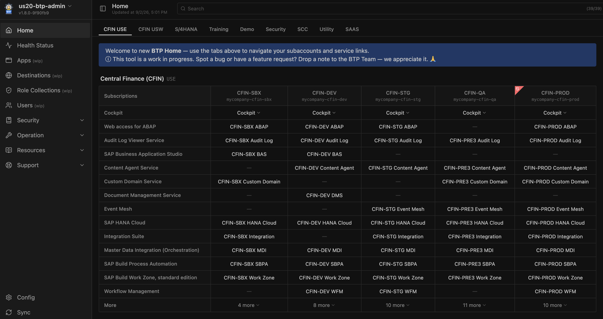
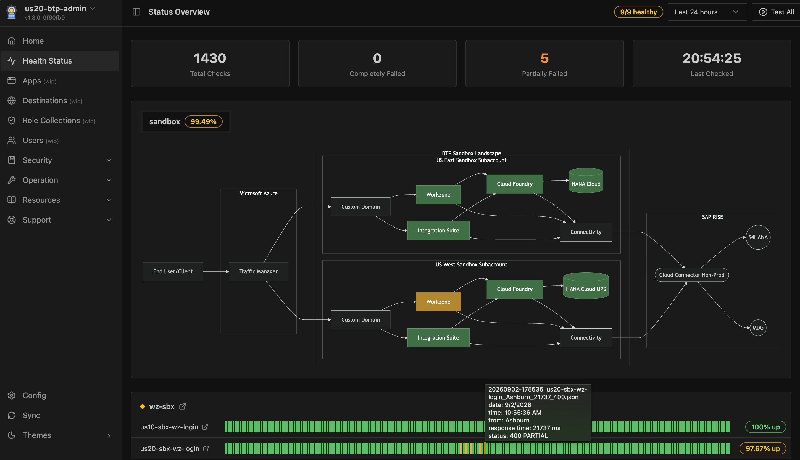

# BTP Admin

A lightweight, file-backed admin dashboard for SAP BTP. Provides a configurable **Homepage** for navigating subaccounts and services across global accounts, cross-subaccount management views for **Destinations**, **Role Collections**, and **Users**, an **Application on Demand** controller for CF apps, and a **Status Page** with a health checker and Azure Traffic Manager integration.

<!-- SCREENSHOT PLACEHOLDER: BTP Admin Homepage — configurable navigation hub with subaccount columns and service links -->

Homepage: <br />


Status Page: <br />


Work-Zone Apps Usage Analytis: <br />


---

## Features

| Feature | Description |
|---------|-------------|
| [**Homepage**](doc/homepage.md) | Configurable navigation hub at `/home` — organise BTP subaccounts into tabs and groups; each column renders service links resolved from named URL templates (Cockpit, BAS, Integration Suite, HANA Cloud, etc.) |
| [**Config & Settings**](doc/config-settings.md) | Manage `subaccounts.json`, `tabs.json`, `settings.json` at `/config`; drag-reorder, live preview panel, runtime variable overrides, change log |
| [**Status Page**](doc/status-page.md) | Scheduled health checks, Azure Traffic Manager probe endpoint, browser-based IAS login simulation, timeline and drill-down history |
| [**Destination Management**](doc/destination-management.md) | Cross-subaccount destination matrix, full-text search, Properties / History / Test tabs, side-by-side compare |
| [**Role Collections**](doc/role-collection-management.md) | Cross-subaccount role collection management — browse, edit, assign/remove users, change history |
| [**User Management**](doc/user-management.md) | Cross-subaccount XSUAA user view — detail, global access tree, change history, full-text search |
| [**Application on Demand**](doc/application-on-demand.md) | CF app scanning, auto-stop idle apps, per-space AOD toggle |
| [**Security**](doc/security.md) | XSUAA OAuth2 session auth, HMAC peer-sync, BTP egress IP filtering for AOD and sync endpoints, sidecar JWT guard |

---

## Quick Start

### Prerequisites

- Node.js 20+
- npm 9+
- A SAP BTP CF service account with **Space Developer** role on all managed subaccounts/spaces — required for subaccount discovery, destination, role collection, and user features; see [Homepage → Prerequisites](doc/homepage.md#prerequisites) for setup
- **Two-instance deployment across two regions is recommended** — BTP Admin persists configuration and runtime data (destinations, role collections, users, response history) in the CF app's local filesystem, which is lost on restart or redeployment. A second instance in another region acts as a sync replica so data survives restarts on either side; see [Development → Remote Sync](doc/development.md#remote-sync) for setup
- (For BTP deployment) `npm install -g mbt` and `cf install-plugin multiapps`

See [Config & Settings](doc/config-settings.md) for a full reference of `settings.json`, `tabs.json`, and runtime variable configuration.

### Install & run locally

```bash
# Install dependencies (also installs Chromium for browser-based health checks)
npm install

# Copy sample config and edit it with your CF credentials and any status-check services
cp sample/config.json server/config.json
```

Open `server/config.json` and set at minimum:

```json
{
  "variables": {
    "CF_USERNAME": "your-btp-service-account@example.com",
    "CF_PASSWORD": "your-password"
  }
}
```

```bash
# Start Vite dev server + Express on :3000
npm run dev
```

Open http://localhost:3000/ — then click the **gear icon** (bottom-left) to open the Config page, go to the **Subaccounts** tab, and press **Refresh** to discover and load all subaccounts the service account has access to.

### Build & deploy to SAP BTP

```bash
# Log in to BTP Cloud Foundry
cf login -a https://api.cf.<region>.hana.ondemand.com
cf target -o <org> -s <space>

# Build then deploy (standard)
npm run bd

# Build then deploy (blue-green, zero-downtime — recommended when Azure TM is connected)
npm run bd-bg
```

> **Re-deploy without rebuilding**: `npm run deploy` / `npm run deploy-bg`

> **Config file in MTA**: `server/config.json` is bundled into the MTA archive at build time. To use different settings across environments (dev / test / prod) without rebuilding, set the `CONFIG_JSON` environment variable on the CF app — it takes priority over the bundled file. See [doc/config-settings.md](doc/config-settings.md) for details.

After deploying, assign role collections in **BTP Cockpit → Security → Role Collections**:
- **BTP Admin** — grants access to the Config page and all admin features (Destinations, Role Collections, Users, AOD); assign to all admin users

For detailed deployment configuration (env vars, blue-green strategy, post-deploy config, RFC sidecar, auth) see [doc/development.md](doc/development.md).

For XSUAA setup, session auth, BTP egress IP filtering (AOD and sync endpoints), and the full API endpoint protection reference see [doc/security.md](doc/security.md).
