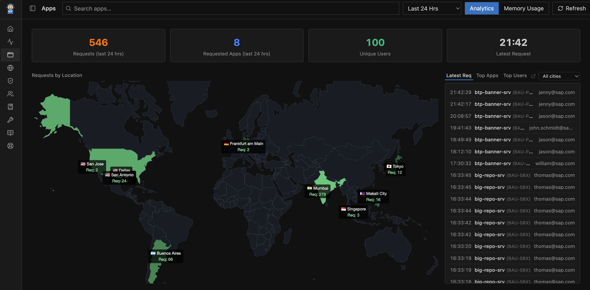

# Application on Demand (AOD)

The **Application on Demand** feature manages CF apps running in your BTP spaces. It scans for apps bound to Destination or other service instances, surfaces their status in the **Apps** tab (`/apps`), and can automatically stop idle apps after a configured inactivity threshold — reducing unnecessary CF runtime costs.

<!-- SCREENSHOT PLACEHOLDER: Apps overview page — list of CF apps across subaccounts with status, space, and last-activity info -->

<!-- SCREENSHOT PLACEHOLDER: Subaccount modal — Apps tab showing space-level app list with start/stop controls -->

Work-Zone Apps Usage Analytis after enabling AOD:  

## Features

- **Apps Overview** (`/apps`) — cross-subaccount view of CF apps across all spaces with `manageDest = true` or `useAOD = true`; shows app name, state (STARTED / STOPPED), space, last activity time, and bound services
- **AOD checkbox per space** — in the Subaccount Detail modal → Overview tab, each space has an **AOD** toggle that controls whether automatic app management is active for that space
- **Auto-stop idle apps** — when `STOP_APPS_UNUSED_AFTER_HRS` is set, the server periodically checks for AOD-managed apps that have been idle longer than the threshold and stops them via the CF API; this keeps dormant apps from consuming quota
- **CF app scan** — the `REFRESH_APPS_INTERVAL_HRS` interval controls how often the server re-scans CF for app state changes; saving the interval in the Variables settings panel restarts the scheduler immediately

---

## Configuration

AOD is configured through space-level toggles in the Subaccount Detail modal and through runtime variables:

### Enabling AOD per space

1. Open the **Config** page (`/config`)
2. Select a subaccount, open its detail modal
3. In the **Overview** tab → Spaces panel, click **Edit**
4. Enable the **AOD** checkbox for one or more spaces
5. Click **Save** — a prompt will appear asking whether to refresh destination data for the updated spaces

### Runtime variables

Set these in `config.json → variables`, as individual environment variables, or via **Config → Settings → Variables**:

| Variable | Default | Description |
|----------|---------|-------------|
| `REFRESH_APPS_INTERVAL_HRS` | — | CF app scan interval in hours. Saving a new value via the Variables settings panel restarts the scheduler immediately. |
| `STOP_APPS_UNUSED_AFTER_HRS` | `0` | Stop AOD-managed apps that have been idle for this many hours. `0` = disabled. |

### Restricted subaccounts

AOD is forcibly disabled for subaccounts listed in `RESTRICTED_SUBACCOUNT_IDS`. The `useAOD` flag is always returned as `false` for restricted subaccounts regardless of stored config. See [Destination Management](destination-management.md#restricted-subaccounts) for details.

---

## How auto-stop works

1. The scheduler fires every `REFRESH_APPS_INTERVAL_HRS` hours
2. For each space with `aod = true`, the server fetches the current app list from the CF v3 API
3. Apps that have been in `STOPPED` state — or have had no incoming HTTP requests — for longer than `STOP_APPS_UNUSED_AFTER_HRS` hours are stopped via `POST /v3/actions/stop`
4. The action is logged and reflected in the next Apps Overview refresh

> Apps that are already stopped are skipped. Only apps in spaces with the AOD toggle enabled are considered.
