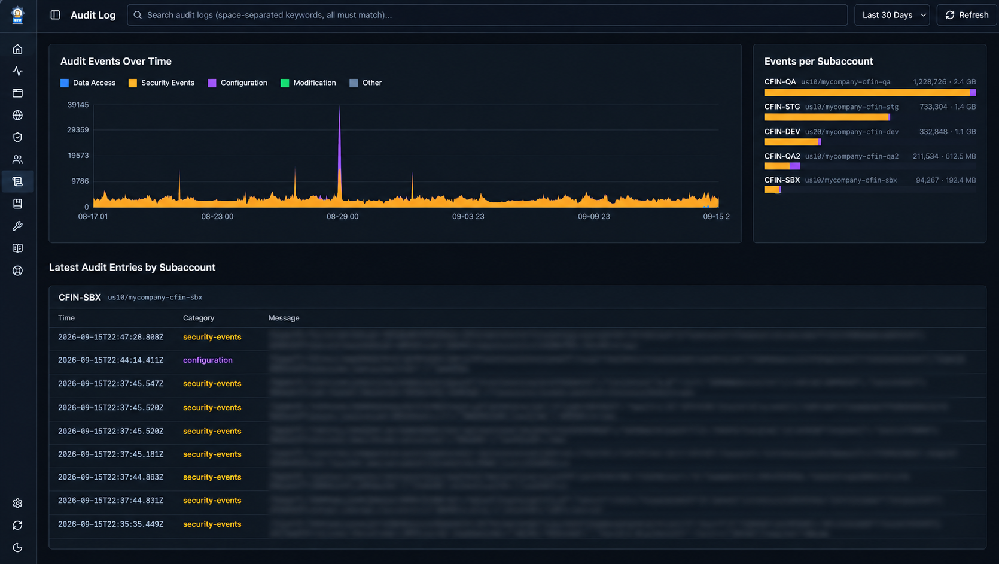
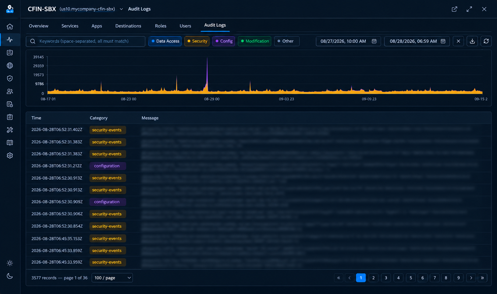

# Audit Log Viewer

> **Storage note:** BTP Admin stores audit log data in the CF app's local filesystem.
> The file system is limited (typically 10 GB disk quota shared with all other stored data).
> Full audit history for many subaccounts over multiple months can easily exceed this limit.
> The Audit Log Viewer is designed for **focused, temporary analysis** — enable it for a
> subaccount, retrieve the relevant time window, investigate, then disable if you no longer
> need ongoing collection. Use `MAX_AUDIT_LOG_STORAGE_DAYS` (see below) to bound how far
> back the retrieval window reaches.

---

## Overview

The Audit Log Viewer fetches event records from the **SAP Audit Log Management Service API**
(`auditlog/v2/auditlogrecords`) for selected subaccounts and stores them locally so you can
search, filter, and browse them without hitting the API on every query.

<!-- SCREENSHOT PLACEHOLDER: Audit Logs overview page showing the timeline bar chart
     (four stacked series per hour), subaccount filter chips, search bar, and latest entries table.
     Capture at /audit-logs after running a refresh for at least two subaccounts. -->



Four event categories are tracked:

| Category | Label | Colour |
|---|---|---|
| `audit.data-access` | Data Access | Blue |
| `audit.security-events` | Security | Amber |
| `audit.configuration` | Configuration | Purple |
| `audit.data-modification` | Modification | Green |

---

## Prerequisites

Each subaccount you want to collect audit logs for must have an **auditlog-management service
instance** (plan `default`) in one of its CF spaces.

BTP Admin discovers the instance automatically via the CF API using the CF service account
credentials (`CF_USERNAME` / `CF_PASSWORD`). It then locates or creates a service key:

1. If a service key named **`btp-admin-sk`** already exists → use it.
2. If other keys exist → use the first available.
3. If no keys exist → create `btp-admin-sk` automatically and use it.

The plan GUID is cached in `~/.ba/cf_login_tokens.json` (under each region) to avoid a CF API
round-trip on every refresh. Service key credentials are cached in
`~/.ba/auditlog-management-keys.json`, keyed by `{region}/{instanceId}`.

---

## Enabling Audit Log Collection

1. Open **Config → Subaccounts**.
2. Tick the **Aud** checkbox for each subaccount you want to collect logs for.
3. Save the configuration.

Once enabled, the subaccount appears in the Audit Log Viewer's refresh cycle and is visible on
the `/audit-logs` page.

<!-- SCREENSHOT PLACEHOLDER: Config → Subaccounts table with the "Aud" column highlighted.
     Show at least one row with the checkbox ticked.
     Capture at /config (Subaccounts tab). -->

---

## Running a Refresh

### All enabled subaccounts (global refresh)

Click **Refresh** on the Audit Logs overview page (`/audit-logs`). A progress bar shows
`Refreshing N/M subaccounts — alias (page P · last-timestamp)` as each subaccount is processed.
The bar turns green on completion and amber if there were warnings (e.g. a missing service
instance).

### Single subaccount (modal refresh)

Open a subaccount modal → **Audit Log** tab → click the **Refresh** icon button next to the
subaccount name. A thin progress bar below the toolbar shows percentage completion estimated
from how far through the time window the latest API page has reached.

<!-- SCREENSHOT PLACEHOLDER: Subaccount modal Audit Log tab during a single-SA refresh.
     Show the progress bar partially filled, with page number and last-timestamp text.
     Capture while refresh is in progress. -->


---

## Storage Layout

Audit log files are stored under `{LOCAL_STORE_DIR}/audit-log/{region}/{subdomain}/`.

Each file covers one UTC hour and is named:

```
YYYY-MM-DDTHH_{da}_{se}_{cfg}_{dm}.json
```

where `da` / `se` / `cfg` / `dm` are the counts for data-access, security-events,
configuration, and data-modification events in that hour. The counts are embedded in the
filename so the overview chart can be rendered without reading every file.

Within each file, records are stored as a JSON array, one object per line, sorted by `time`.
If a refresh overlaps an existing hour file, records are merged (deduplicated by `uuid`) and
the filename is updated to reflect the new counts.

---

## Configuration

| Variable | Default | Description |
|---|---|---|
| `MAX_AUDIT_LOG_STORAGE_DAYS` | `90` | How many days back the retrieval window reaches when no existing data is found for a subaccount. On subsequent refreshes the window starts from the timestamp of the last saved record. Set lower to limit disk usage. |

Set variables in **Config → Settings → Variables** or in `config.json → variables`.

---

## Exporting

Click the **Download** (↓) icon button in the subaccount modal Audit Log tab toolbar to export
the currently filtered audit logs as a ZIP file.

The export uses the **From / To** date-time range and any **keywords** currently entered in the
search bar. The exported filename is `audit-log_{region}_{subdomain}.zip`.

### Without keywords

All matching audit log JSON files for the selected time range are packaged into the ZIP. Files
are matched by their UTC hour key (filename prefix), rounded inclusively — so a `From` of
`10:30` includes the `T10` file.

If the matched files total more than **1 GB** (indicating the ZIP would likely exceed 100 MB),
a warning appears:

> _"The selected time range covers N file(s) totalling X.X GB. The export ZIP may exceed
> 100 MB. Consider choosing a smaller time range or entering keywords to filter records."_

You can then **Cancel** and narrow the range, or click **Export anyway** to proceed.

### With keywords

When one or more keywords are entered, only the individual JSON records matching **all**
keywords (case-insensitive AND logic) are extracted from the matching files. The filtered
records are written to a single `audit-export-*.json` file (a valid JSON array), which is
then compressed into the ZIP. The 1 GB size check is skipped because keyword filtering
dramatically reduces the output size.

<!-- SCREENSHOT PLACEHOLDER: Subaccount modal Audit Log tab showing the Export warning banner
     (amber background) with "Export anyway" and "Cancel" buttons.
     Trigger by selecting a wide time range (e.g. 90 days) with no keywords and clicking Export. -->

---

## Overview Charts

The `/audit-logs` overview page displays two chart panels side by side.

### Audit Events Over Time (left, 75 %)

A stacked area chart showing hourly event counts across all enabled subaccounts. Four series are stacked (Data Access / Security / Configuration / Modification); click a series label to toggle it. Drag across the chart to select a time range — the "Latest Entries" table below filters to that window. Click **Clear selection** in the legend to reset.

<!-- SCREENSHOT PLACEHOLDER: Audit Events Over Time area chart with all four series visible and one hour range selected (selection rectangle visible). Capture at /audit-logs after a refresh. -->

### Events per Subaccount (right, 25 %)

A stacked horizontal bar chart showing the **total** event count per subaccount for the selected duration and keyword. Each bar is split by category (Data Access = blue, Security = amber, Configuration = purple, Modification = green, Other = grey). Bar width is proportional to the maximum total across all subaccounts, so the largest subaccount fills the full panel width and smaller ones are scaled accordingly.

Subaccounts are sorted by total event count (descending). Hover a segment to see the exact count for that category. If there are many subaccounts the panel scrolls internally — the panel height matches the area chart.

The chart respects the same **duration** and **keyword** filters as the area chart: when a keyword is active, counts reflect only matching records (sourced from the keyword-filtered grep results, not filename counts).

<!-- SCREENSHOT PLACEHOLDER: Events per Subaccount bar chart panel showing 4–6 subaccounts with coloured bar segments and count labels. Capture at /audit-logs with the bar chart panel visible on the right. -->

---

## Searching

### Overview page (`/audit-logs`)

- **Keyword search** — type one or more words separated by spaces in the search box.
  All keywords must appear in a record (case-insensitive AND logic). Matches are highlighted
  in the results table.
- **Duration filter** — select 7 d / 30 d / 90 d to restrict the time window shown in the
  chart and the latest-entries table.
- **Category filter** — click the category chips (Data Access, Security, Config, Modification)
  to toggle visibility.
- **From / To** — use the date-time pickers to restrict to an exact range.

### Per-subaccount tab (modal)

- **Keyword search** — same AND logic as the overview page. Keywords are highlighted in the
  record list.
- **From / To date-time pickers** — restrict records to a custom time range. Both inputs are
  optional; leaving them blank retrieves all stored records for the subaccount.
- **Page size** — select 100 / 200 / 500 / 1 000 records per page. The selection persists in
  browser `localStorage` and is restored when the tab is reopened.
- **Expand a record** — click any row to expand it and see the full record detail including
  all technical fields (`uuid`, `time`, `category`, `orgId`, `spaceId`, `correlationId`, etc.)
  alongside the parsed message body. Click again to collapse.
- **URL sync** — when the subaccount modal is open the browser URL updates to
  `/audit-logs/{region}/{subdomain}[?q=keyword]`. Refreshing the page reopens the same
  subaccount and pre-fills the keyword. Closing the modal restores the overview URL
  (`/audit-logs[?q=...&duration=...]`).

<!-- SCREENSHOT PLACEHOLDER: Subaccount modal Audit Log tab with a search keyword entered,
     showing highlighted matches and one row expanded with full record detail.
     Capture at /config (any subaccount modal → Audit Log tab). -->

---

## Architecture

```
┌─────────────────────────────────┐
│  SAP Audit Log Management API   │
│  auditlog/v2/auditlogrecords    │
└────────────┬────────────────────┘
             │ HTTPS (Bearer, paginated)
             ▼
┌─────────────────────────────────┐
│  auditLogService.ts             │
│  · getAuditLogCredentials()     │  ←── CF API: plan GUID → instance → key
│  · getAuditLogToken()           │  ←── UAA: client_credentials grant
│  · refreshAuditLogs()           │  global refresh (all enabled SAs)
│  · refreshSubaccountAuditLogs() │  single-SA refresh (SSE progress)
│  · parseAndSaveRecords()        │  merge + dedupe per-hour files
└────────────┬────────────────────┘
             │ writes
             ▼
┌─────────────────────────────────┐
│  localStore/audit-log/          │
│    {region}/{subdomain}/        │
│      YYYY-MM-DDTHH_N_N_N_N.json│
└─────────────────────────────────┘
             │ reads
             ▼
┌─────────────────────────────────┐
│  auditLog.ts route              │
│  GET /api/audit-log/stats       │  chart data (counts from filenames)
│  GET /api/audit-log/search      │  keyword search (reads file content)
│  GET /api/audit-log/records     │  paginated records for modal tab
│  POST /api/audit-log/refresh    │  global + single-SA refresh trigger
└─────────────────────────────────┘
             │ SSE
             ▼
┌─────────────────────────────────┐
│  AuditLogPage.tsx               │  /audit-logs overview
│  AuditLogTab.tsx                │  subaccount modal tab
└─────────────────────────────────┘
```

<!-- DIAGRAM PLACEHOLDER: Replace the ASCII diagram above with a rendered architecture diagram.
     Suggested tool: draw.io / Excalidraw.
     Show: Audit Log Management API → auditLogService → local filesystem → REST routes → React pages.
     Include the CF API credential discovery path (plan → instance → service key → UAA token). -->

---

## Tips and Limitations

- **Disk quota** — each hour file is typically 50–500 KB depending on event volume. A busy
  subaccount can generate hundreds of files per day. Monitor disk usage with
  `cf app btp-admin` and set `MAX_AUDIT_LOG_STORAGE_DAYS` conservatively.
- **Rate limits** — the Audit Log API enforces per-region rate limits. BTP Admin paginates
  with a short inter-page delay and retries on HTTP 429 with `Retry-After`.
- **Service key auto-creation** — if no service key exists, BTP Admin creates `btp-admin-sk`
  automatically. The key is reused on every subsequent refresh. If you delete it from the CF
  cockpit, it will be re-created on the next refresh.
- **Time zones** — all timestamps are stored and displayed in UTC. The From / To pickers
  accept local browser time and convert to UTC internally.
- **Sync** — audit log files are included in the remote sync batch (`audit-log/` prefix,
  priority 4 in the sync sequence) so a replica instance receives the same data.
