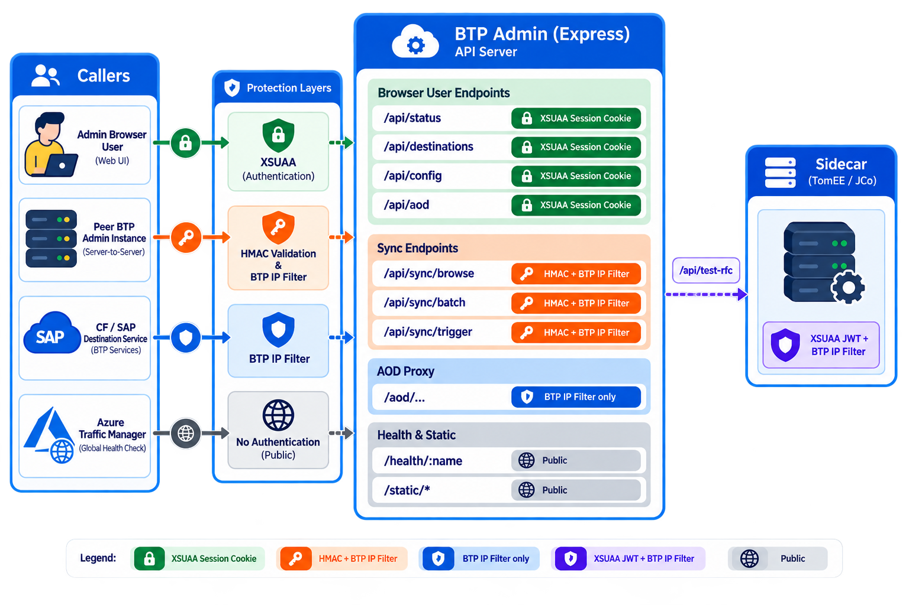

# Security

<!-- IMAGE PLACEHOLDER
  Diagram: API endpoint protection overview

  Prompt for image generation:
  "A clean technical architecture diagram on a white background showing how different callers access the BTP Admin server's API endpoints, with labeled protection layers. Three caller types on the left: (1) Admin Browser User (person icon), (2) Peer BTP Admin Instance (server icon), (3) CF/SAP Destination Service (cloud icon). In the center, a vertical box labeled 'BTP Admin (Express)' with grouped endpoint rows inside. Each row shows the endpoint path and a colored protection badge: green badge labeled 'XSUAA Session Cookie' for browser-user endpßoints (/api/status, /api/destinations, /api/config, /api/aod etc.), orange badge labeled 'HMAC + BTP IP Filter' for sync endpoints (/api/sync/browse, /api/sync/batch, /api/sync/trigger), blue badge labeled 'BTP IP Filter only' for the /aod proxy, and grey badge labeled 'Public' for /health/:name and static assets. A fourth column on the right shows the 'Sidecar (TomEE/JCo)' box receiving /api/test-rfc calls from the BTP Admin server, protected by 'XSUAA JWT + BTP IP Filter'. Use a minimal flat design with sans-serif labels, soft drop shadows on boxes, and a light blue/slate color palette."
-->



## Authentication & Authorization

When deployed to SAP BTP with a **XSUAA** service binding (`VCAP_SERVICES` contains an `xsuaa` entry), the app enforces authentication automatically. Authentication follows the **OAuth2 Authorization Code flow** via a browser popup — no `@sap/approuter`. Everything uses `node:crypto` and the Node.js standard library.

> **!** When XSUAA is not present (e.g. running locally with `npm run dev`), all authentication and authorisation checks are bypassed — all endpoints and admin controls are openly accessible.

### OAuth2 Login Flow & CSRF Protection

The login popup navigates to `/login`, which generates a 16-byte random `state` token, stores it in a short-lived `btpstate` cookie (HttpOnly, SameSite=Lax, 5-minute Max-Age), and includes it in the XSUAA authorize URL. On the `/login/callback`, the `state` query parameter returned by XSUAA is compared against the cookie; a mismatch (or missing cookie) is rejected with 400 before the authorization code is exchanged. This prevents login CSRF / session fixation attacks.

### Session Cookie

| Property | Value |
|----------|-------|
| Name | `btpauth` |
| Signing | HMAC-SHA256 (key = XSUAA `clientsecret`); verified with `timingSafeEqual` |
| HttpOnly | Yes |
| Secure | Yes on BTP (`VCAP_APPLICATION` present); omitted for local HTTP dev |
| SameSite | Lax |

The `btpauth` cookie is never forwarded to upstream CF apps through the AOD proxy — it is stripped from the `Cookie` header before the request is forwarded.

### Role Collections

One role collection is created automatically on first deploy:

| Role Collection | Access |
|-----------------|--------|
| **BTP Admin** | Full admin access — Config page, Subaccounts Refresh, Destinations, Role Collections, Users, AOD, Variables settings, status page eval mode and schedule overrides |

After deploying to BTP, assign the role collection in **BTP Cockpit → Security → Role Collections**:
- Assign **BTP Admin** to all users who need admin access to the app

### Protected Routes

| Route | Guard |
|-------|-------|
| `GET /api/check/:name` | Auth required |
| `POST /api/sync` | Auth required |
| `GET /api/view?path=…` | Auth required |
| `POST /api/eval-mode/:name` | Admin required |
| `POST /api/schedule/:name` | Admin required |
| `GET /api/sync/browse` | HMAC sync only |
| `POST /api/sync/batch` | HMAC sync only |
| `GET /api/sync/trigger` | HMAC sync only |

All read-only data endpoints and static assets are public regardless of auth state.

### BTP Setup

XSUAA is already wired in `mta.yaml` and `xs-security.json` (committed to the repo). On first deploy BTP provisions the service instance automatically — no manual steps needed beyond assigning role collections to users.

When `VCAP_SERVICES` is not set (local dev), all auth middleware passes through — no login required and all controls remain fully active.

---

## API Endpoint Protection Overview

Different endpoints use different protection mechanisms depending on the intended caller:

| Endpoint(s) | Caller | Protection |
|-------------|--------|------------|
| `GET /health/:name` | Azure Traffic Manager, public | Public (no auth) |
| `GET /`, `GET /home`, `GET /config`, … | Browser / SPA | Static assets — public; `index.html` served for all non-`/api` paths |
| `GET /api/services`, `GET /api/overview`, `GET /api/history/*` | Browser (authenticated) | XSUAA session cookie (`btpauth`) when XSUAA is bound; pass-through in local dev |
| `GET /api/check/:name`, `GET /api/view` | Browser (authenticated) | XSUAA session cookie — auth required |
| `POST /api/eval-mode/:name`, `POST /api/schedule/:name` | Browser (admin) | XSUAA session cookie — **admin** role required |
| `GET/POST /api/config/*`, `GET/POST /api/settings/*` | Browser (admin) | XSUAA session cookie — **admin** role required |
| `GET/POST /api/destinations/*`, `/api/role-collections/*`, `/api/users/*` | Browser (admin) | XSUAA session cookie — **admin** role required |
| `GET /api/sync/browse` | Peer BTP Admin instance | **HMAC** (`x-sync-ts` + `x-sync-sig`) + **BTP egress IP filter** |
| `POST /api/sync/batch` | Peer BTP Admin instance | **HMAC** + **BTP egress IP filter** |
| `GET /api/sync/trigger` | Peer BTP Admin instance | **HMAC** + **BTP egress IP filter** |
| `ANY /aod/*` | SAP Destination Service (CF apps) | **BTP egress IP filter** only — no session auth (callers are CF services, not browsers) |
| `POST /api/test-rfc` → sidecar | BTP Admin server → Sidecar (TomEE) | **XSUAA JWT** (Bearer token in `Authorization` header) + **BTP egress IP filter** |

### Protection mechanisms

**XSUAA session cookie** (`btpauth`) — present when the user has completed the XSUAA OAuth2 Authorization Code login flow. The cookie is HMAC-SHA256 signed with the XSUAA `clientsecret` and verified with `timingSafeEqual` on every request. Login CSRF is prevented by a short-lived `btpstate` cookie verified at the callback (see [OAuth2 Login Flow & CSRF Protection](#oauth2-login-flow--csrf-protection)). When XSUAA is not configured (local dev), all session guards pass through.

**HMAC peer-sync** — sync endpoints require both a valid HMAC signature (`x-sync-ts` + `x-sync-sig` headers, signed with `SYNC_KEY`) and an IP from the BTP egress ranges. Either check failing is independently sufficient to reject the request. The `callback` URL registered via `GET /api/sync/browse?callback=…` is validated against BTP CF app domain patterns (`*.cfapps.*.hana.ondemand.com`) and the configured `SYNC_REMOTE`/`SELF_URL` values — arbitrary URLs are rejected to prevent SSRF.

**BTP egress IP filter** — applied to `/aod` (destination service calls) and `/api/sync/*` (peer instance calls). Three IP sets are always allowed: (1) BTP CF egress IPs from `server/config/btp-endpoints.json`, (2) RFC 1918 private ranges (`10.0.0.0/8`, `172.16.0.0/12`, `192.168.0.0/16`) — required because CF internal / container-to-container calls (e.g. Workzone → BTP Admin, BTP Admin → sidecar) arrive with a private `10.x` IP, and (3) loopback for local dev. The source IP is read from `x-cf-true-client-ip` (trusted only when `VCAP_APPLICATION` is set, i.e., running on CF) or the socket-level IP otherwise — preventing header spoofing in non-CF environments. Disable with `AOD_NO_IP_PROTECTION=true` or `SYNC_NO_IP_PROTECTION=true`; extend with `AOD_WHITELIST_IPS`, `SYNC_WHITELIST_IPS`, or `SYNC_INTERNAL_IP_WHITELIST`. The BTP egress list is a no-op when `btp-endpoints.json` is absent and no extra whitelist is configured (RFC 1918 and loopback still apply).

For AOD geo-location, the first entry of `x-forwarded-for` is used as the user IP (the actual browser user's public IP, prepended by the CF GoRouter chain). `x-cf-true-client-ip` identifies the CF service caller (e.g. Workzone or Destination Service) and is used only for filtering, not geo lookup.

**HTTP security headers** — every response includes `X-Frame-Options: SAMEORIGIN` (clickjacking protection), `X-Content-Type-Options: nosniff` (MIME sniffing protection), and `Referrer-Policy: strict-origin-when-cross-origin`. On BTP (`VCAP_APPLICATION` present), `Strict-Transport-Security: max-age=31536000; includeSubDomains` is also set.

**XSUAA JWT (sidecar)** — the sidecar (TomEE WAR) validates the JWT Bearer token in the `Authorization` header; the XSUAA public key is loaded from `VCAP_SERVICES` at startup. It also applies the BTP egress IP filter from its bundled `WEB-INF/btp-endpoints.json` (copied by `sidecar/build.sh`) and enforces the `admin` role via `<auth-method>XSUAA</auth-method>` in `web.xml`.

### `btp-endpoints.json`

The file at `server/config/btp-endpoints.json` contains BTP CF egress IPs for all regions and is the shared source of truth for both the Node.js server and the sidecar WAR. It is **not** committed to git (it can contain hundreds of IPs and changes over time). Keep it updated with the latest SAP CF endpoint data:

1. Download the SAP CF endpoints CSV from the [SAP Help Portal](https://help.sap.com/docs/btp/sap-business-technology-platform/regions-and-api-endpoints-available-for-cloud-foundry-environment) → **Download → CSV → Download all data on all pages**
2. Run:
   ```bash
   npm run parse-btp-endpoints ~/Downloads/sap-cf-endpoints.csv
   ```
3. Rebuild the sidecar WAR (`sidecar/build.sh`) so the updated file is bundled into `WEB-INF/`.

RFC 1918 private ranges and loopback are always allowed regardless of `btp-endpoints.json`. Additional entries can be contributed via `AOD_WHITELIST_IPS`, `SYNC_WHITELIST_IPS`, or `SYNC_INTERNAL_IP_WHITELIST`. HMAC authentication on sync endpoints is enforced independently of IP filtering.
