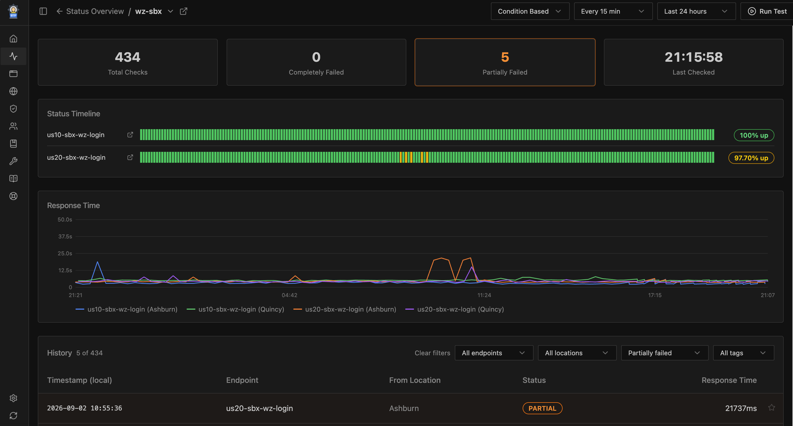

# Status Page

BTP Admin includes a **status monitoring** module that runs scheduled health checks against configured service endpoints, exposes a `/health/:service` probe endpoint for Azure Traffic Manager, and presents a live status timeline with history drill-down.

<!-- SCREENSHOT PLACEHOLDER: Status overview page — landscape diagram with live service status and timeline dots -->
Status Page: <br />


<!-- SCREENSHOT PLACEHOLDER: Service detail page — uptime stats, response time chart, and full check history -->


<!-- SCREENSHOT PLACEHOLDER: Response detail modal — request/response detail and screenshot from a past check -->


## Features

1. **Azure Traffic Manager probe endpoint** — `GET /health/{service}` returns `200 OK`, `200 Partial OK`, or `500 Service down` from saved response files without a live network probe; designed for Traffic Manager polling every 3–5 s from multiple PoPs; region-extracted from the request hostname so each deployed instance reports only its local endpoints

2. **Browser-based IAS login simulation** (`mode: browser-ias-login`) — headless Chromium fills the SAP IAS login form and validates the full authentication flow end-to-end; screenshot, console log, and page source captured on every check and visible in the history drill-down

3. **Evaluation mode override** (`Always OK` / `Always Error`) — per-service toggle to force a service healthy or failing regardless of actual check results; changes take effect immediately on `/health`, scheduled checks, and Run Test

4. **Status timeline, history, and drill-down** — color-coded timeline per endpoint on the Overview page; per-service uptime %, response time chart, and full history table with endpoint/location/status/tag filters; clicking any dot opens a response detail modal with request/response, conditions, and screenshot

5. **Starred response files** — click ⭐ on any history row to pin a record; starred files are retained by housekeeping indefinitely, survive remote sync, and are filterable via **Starred** in the tag filter and the **All Time Starred** date range option

---

## Configuration

The server resolves configuration in this priority order:

1. **`CONFIG_JSON` env var** — JSON string with the full config (useful for BTP env properties, no file needed)
2. **`CONFIG_FILE` env var / default** — path to a JSON file (default: `./config.json` relative to the `server/` working directory)

Create `server/config.json` (copy `sample/config.json` and fill in real values):

```json
{
  "variables": {
    "MONITOR_USERNAME": "monitor@example.com",
    "MONITOR_PASSWORD": "your-monitor-password",
    "SYNC_KEY": "your-secret-sync-key"
  },
  "landscapes": [
    {
      "name": "production",
      "diagram": "flowchart LR\n    User --> my-service"
    }
  ],
  "sites": [
    { "name": "Ashburn",   "url": "https://btp-status-ashburn.cfapps.us10.hana.ondemand.com" },
    { "name": "Frankfurt", "url": "https://btp-status-frankfurt.cfapps.eu10.hana.ondemand.com" }
  ],
  "services": [
    {
      "group": "WorkZone",
      "name": "my-service",
      "enabled": true,
      "landscapes": ["production"],
      "interval": 900,
      "endpoints": [
        {
          "name": "health-check",
          "url": "https://my-service.example.com/health",
          "method": "GET",
          "conditions": ["[STATUS] == 200", "[RESPONSE_TIME] < 3000"]
        },
        {
          "mode": "browser-ias-login",
          "name": "login-check",
          "url": "https://my-service.example.com/login",
          "username": "{{MONITOR_USERNAME}}",
          "password": "{{MONITOR_PASSWORD}}",
          "waitForSelector": "#app-title",
          "timeout": 30,
          "interval": 900,
          "retry": 2,
          "retryDelay": 30
        }
      ]
    }
  ]
}
```

### Top-level fields

| Field | Type | Description |
|-------|------|-------------|
| `variables` | object | Key→value map; `{{key}}` placeholders in endpoint fields are substituted at startup |
| `landscapes` | array | List of landscape definitions for the Overview diagram tabs |
| `landscapes[].name` | string | Landscape identifier (shown as tab label) |
| `landscapes[].diagram` | string | Mermaid diagram source. Nodes whose ID matches a service `name` are coloured by status and link to the service detail page. Nodes in `service.endpoint` format (e.g. `wz-us10.Login`) link to that endpoint's filtered view. |
| `sites` | array | Deployed instances for the site-switcher dropdown (hidden when fewer than 2 entries) |
| `sites[].name` | string | Display name (e.g. `"Ashburn"`) |
| `sites[].url` | string | Base URL of that instance |
| `sites[].legacyUrls` | string[] | Previous/alternative URLs for this site; also checked when matching the current site |
| `services` | array | List of service configs |

> Tip: compose landscape diagrams at [mermaid.live](https://mermaid.live/)

### Per-service fields

| Field | Type | Description |
|-------|------|-------------|
| `group` | string | Group name for dashboard grouping |
| `name` | string | Unique service identifier (used in URLs and diagram node matching) |
| `enabled` | boolean | Set `false` to exclude from checks |
| `interval` | number | Fallback auto-check interval in seconds; overridden per endpoint via `endpoints[].interval`; `0` or omitted disables automatic checks for endpoints without their own interval |
| `homepage` | string | Optional homepage URL shown as ↗ link on the dashboard |
| `landscapes` | string[] | Landscape names this service belongs to |

### Per-endpoint fields

| Field | Type | Description |
|-------|------|-------------|
| `name` | string | Display name (use lowercase-dash names, e.g. `"api-portal"`) |
| `url` | string | URL to probe; set to `/dummy` to skip and always record `200 OK` |
| `method` | string | HTTP method (`GET`, `POST`, etc.) |
| `headers` | object | Request headers; `{{variable}}` placeholders substituted |
| `body` | string\|null | Request body; `{{variable}}` placeholders substituted |
| `conditions` | string[] | Conditions to validate (Gatus syntax) |
| `mode` | string | `browser-ias-login` to use headless Chromium instead of HTTP |
| `username` | string | IAS username for browser login; `{{variable}}` substitution supported |
| `password` | string | IAS password; `{{variable}}` substitution supported |
| `waitForSelector` | string | CSS selector to wait for after login (browser-ias-login only) |
| `timeout` | number | Timeout in **seconds**. For HTTP checks, overrides `REQUEST_TIMEOUT_MS`; timed-out check recorded as `504`. For `browser-ias-login`, the overall session timeout (default `30`s). |
| `interval` | number | Per-endpoint auto-check interval in seconds; takes precedence over service-level `interval` |
| `retry` | number | Max retry attempts on failure |
| `retryDelay` | number | Seconds to wait between retries (default `0`) |
| `region` | string | BTP region code (e.g. `"us10"`). When set, this endpoint is only checked when the request hostname matches `cfapps.<region>.hana`. Scheduler and manual Run Test always run all endpoints. |

---

## Condition Syntax

Conditions follow [Gatus](https://github.com/TwiN/gatus#conditions) syntax:

| Condition | Description | Example |
|-----------|-------------|---------|
| `[STATUS] == 200` | HTTP status code | `[STATUS] == 301` |
| `[RESPONSE_TIME] < 500` | Response time in ms | `[RESPONSE_TIME] < 2000` |
| `[BODY] == "text"` | Body equals string | `[BODY] == "OK"` |
| `[BODY].key == "value"` | JSON body field (dot-path) | `[BODY].status == "healthy"` |
| `[HEADER.name] == "value"` | Response header value | `[HEADER.content-type] == "application/json"` |
| `len([BODY].arr) > 0` | Array/object length | `len([BODY].items) > 0` |
| `[BODY] == pat(*glob*)` | Glob pattern match | `[BODY] == pat(*authentication*)` |

Operators: `==`, `!=`, `<`, `>`, `<=`, `>=`

---

## Browser-based IAS Login Check

Set `mode: "browser-ias-login"` on an endpoint to use a headless Chromium session:

```json
{
  "mode": "browser-ias-login",
  "name": "workzone-login",
  "url": "https://<tenant>.launchpad.cfapps.<region>.hana.ondemand.com/site/<site>?sap_idp=<idp>",
  "username": "monitor@example.com",
  "password": "secret",
  "waitForSelector": "#shellAppTitle",
  "timeout": 30,
  "interval": 900,
  "retry": 2,
  "retryDelay": 30
}
```

Check flow:
1. Launch headless Chromium, navigate to `url`
2. Fill `#j_username`, click `#next-button`
3. Fill `#j_password`, click `#logOnFormSubmit`
4. Wait for `waitForSelector` to appear — success if found before `timeout`, failure otherwise
5. Capture screenshot, browser console messages, and page HTML source

Three sidecar files are saved alongside the JSON record:
- `…_{status}.png` — screenshot
- `…_{status}_console.log` — timestamped browser console output
- `…_{status}_content.html` — raw HTML of the page at check completion

The **Response Detail** modal shows four tabs for browser checks:

| Tab | Content |
|-----|---------|
| **Overview** | Check metadata, result message, conditions table |
| **Screenshot** | Full-page screenshot |
| **Console** | Timestamped browser console messages |
| **Page Source** | Raw HTML of the page |

> **Chromium setup (local dev)**: installed automatically into `server/pw-browsers/` via `npm install` postinstall hook. `npm run dev` and `npm start` set `PLAYWRIGHT_BROWSERS_PATH=./pw-browsers` automatically. On SAP BTP Cloud Foundry, Chrome is installed via the apt-buildpack.

---

## Automatic Checks

When `interval` is set on an endpoint, the server runs a health check every `interval` seconds. Each endpoint is scheduled independently.

- If a check is already running when the next tick fires, that tick is **skipped** (no pile-up).
- Timers are released with `unref()` — they do not block graceful shutdown.
- On `SIGTERM` / `SIGINT` the scheduler stops cleanly.

---

## Retry Behavior

When `retry` is set on an endpoint:

1. Initial check runs; if it fails and `retry > 0`, retry attempts begin.
2. Each retry waits `retryDelay` seconds, then re-runs the full check.
3. Each retry result is saved as a sidecar file (e.g. `…_500.retry.json`) linked from the main record's `retryFiles` field.
4. If **any** retry succeeds → main result saved as `400` (**Partially Failed**).
5. If **all** retries fail → main result is `500` / `504` (**Completely Failed**).

Retry files are excluded from the history list and timeline dots. The **Response Detail** modal shows a **Retries** tab when `retryFiles` is non-empty.

---

## Azure Traffic Manager

Point your Traffic Manager HTTP probe at:

```
GET https://<your-app>/health/<service-name>
```

The probe reads saved response files and replies in milliseconds — no live network request. Safe to call at 3–5 s intervals from multiple PoPs.

**Time window**: for each endpoint, files within `[now − endpoint.interval × 2, now]` are considered.

**Region filtering**: the incoming hostname (`cfapps.<region>.hana`) is matched against `endpoints[].region`. Endpoints without `region` are always included.

**Response body**:

| HTTP | Body | Meaning |
|------|------|---------|
| `200` | `{"status":"OK","locations":{"Ashburn":200,…}}` | All locations `200`/`203` |
| `200` | `{"status":"Partial OK","locations":{"Ashburn":200,"Frankfurt":400,…}}` | At least one non-200, not all down |
| `500` | `{"status":"Service down","locations":{"Ashburn":500,…}}` | All locations `500`/`503`/`504` |
| `200` | `{"status":"OK","locations":{},"note":"no recent data"}` | No files in window — treated as healthy |

Evaluation mode overrides: `alwaysok` → always `200`, `alwayserror` → always `500`.

---

## Evaluation Mode & Schedule

On any service's detail page (`/service/:name`), two selectors control the service without restarting:

**Evaluation Mode**:

| Mode | `/health/:name` | Saved status | Timeline dot |
|------|----------------|-------------|--------------|
| **Condition Based** (default) | Latest file result | `200` or `500` | Green / Red |
| **Always OK** | Always `200 OK` | `203` | Dark green |
| **Always Error** | Always `500` | `503` | Dark red |

**Schedule**:

| Option | Effect |
|--------|--------|
| Every 5 / 10 / 15 / 30 min / 1 hour | Reschedules immediately; overrides `config.json` interval |
| Disable autorun | Stops scheduled checks |

All overrides are in-memory and reset to `config.json` defaults on server restart.

---

## Response File Storage

Each health check saves a file at:

```
./localStore/resp/{service-name}/yyyyMMdd-HHmmss_{endpointSlug}_{city}_{ms}_{status}.json
```

| Part | Notes |
|------|-------|
| `yyyyMMdd-HHmmss` | UTC timestamp |
| `endpointSlug` | endpoint `name` with non-alphanumeric chars replaced by dashes |
| `city` | city from ip-api.com, spaces replaced by dashes; `unknown` if lookup fails |
| `status` | `200` pass · `203` Always OK · `400` Partially Failed · `500` fail · `503` Always Error · `504` timeout |

---

## API Endpoints

| Endpoint | Description |
|----------|-------------|
| `GET /health/:name` | Latest saved check result (no live probe): `200 OK`, `200 Partially OK`, or `500 service down`; region-filtered |
| `GET /api/services` | List all services (JSON) |
| `GET /api/check/:name` | Run health check, return structured JSON (used by Run Test) — auth required |
| `GET /api/overview?hours=24` | Overview data for all services; also accepts `?from=YYYY-MM-DD&until=YYYY-MM-DD` |
| `GET /api/history/:name?hours=24` | History file list for a service; also accepts date range params |
| `GET /api/history/:name/:filename` | Full request/response detail for one check |
| `GET /api/info` | Server capabilities: `{ syncRemote, city, sites, maxStorageDays }` |
| `GET /api/eval-mode/:name` | Current evaluation mode |
| `POST /api/eval-mode/:name` | Set evaluation mode — admin required |
| `GET /api/schedule/:name` | Current effective interval |
| `POST /api/schedule/:name` | Set schedule override — admin required |
| `GET /api/view?path=…` | View a response file from `resp/` — auth required |

See [Development → Authentication & Authorization](development.md#authentication--authorization) for session cookie details, protected routes, and BTP XSUAA setup.
